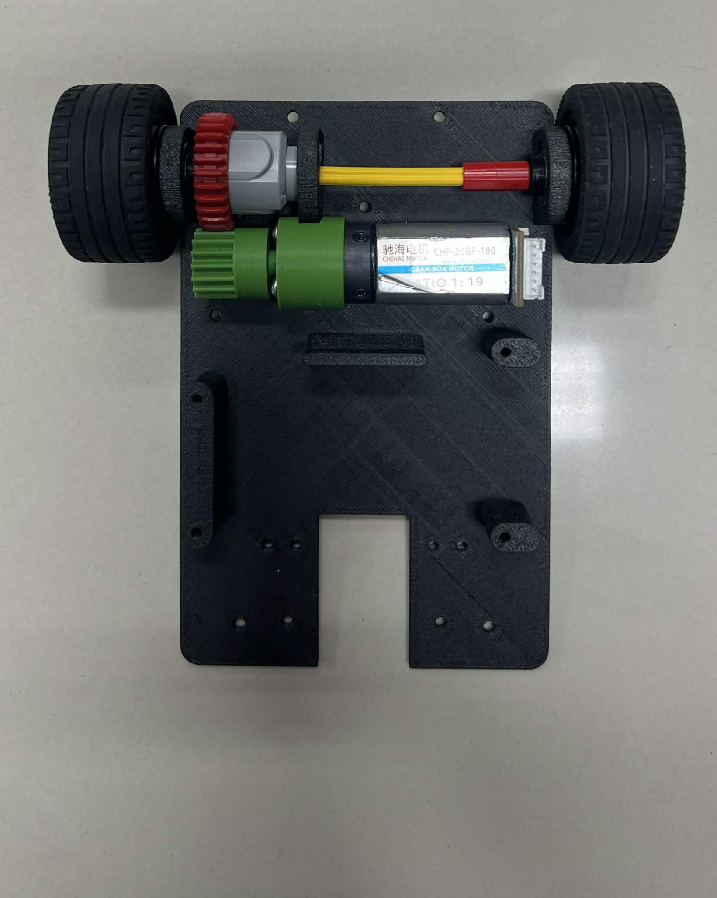
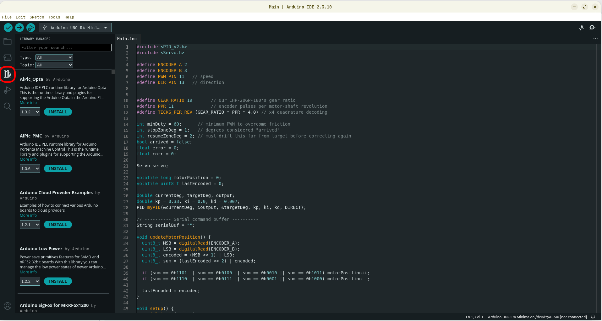
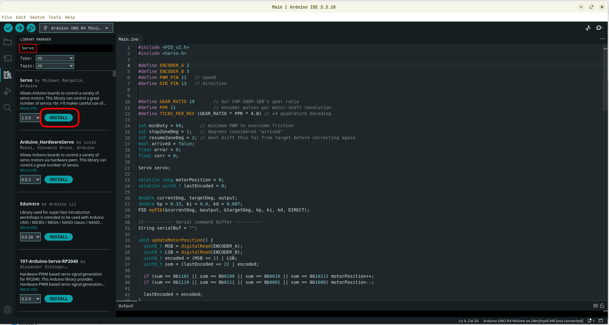
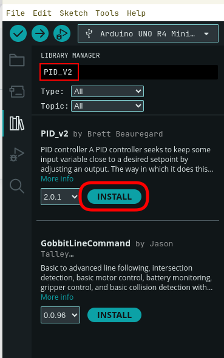

# Build & Reproduction Guide

This document is the complete reproduction guide for the **YBR-SUNFLOWER WRO 2026 Future Engineers robot**.

Its purpose is different from the subsystem engineering documentation.

The subsystem documents explain **why** the robot was designed as it is:

- [`mech/mech_README.md`](mech/mech_README.md) — mechanical design and mobility
- [`elec/elec_README.md`](elec/elec_README.md) — power, electrical and sensor architecture
- [`software/software_README.md`](software/software_README.md) — software and autonomous navigation

This document explains **how to reproduce the final robot**.

A successful reproduction should be able to:

1. manufacture the mechanical parts,
2. assemble the drivetrain and steering system,
3. install the electronics and sensors,
4. reproduce the electrical wiring,
5. configure the Raspberry Pi and Arduino,
6. install the exact software dependencies,
7. verify every subsystem individually,
8. run the autonomous software,
9. and reproduce the final competition configuration.

---

# Contents

1. [Reproduction Overview](#1-reproduction-overview)
2. [Before You Start](#2-before-you-start)
3. [Bill of Materials](#3-bill-of-materials)
4. [Tools and Manufacturing Equipment](#4-tools-and-manufacturing-equipment)
5. [3D Printing and Mechanical Preparation](#5-3d-printing-and-mechanical-preparation)
6. [Mechanical Assembly](#6-mechanical-assembly)
7. [Electrical Assembly and Wiring](#7-electrical-assembly-and-wiring)
8. [Electrical Pre-Power Verification](#8-electrical-pre-power-verification)
9. [Raspberry Pi Software Setup](#9-raspberry-pi-software-setup)
10. [Arduino Setup and Firmware Upload](#10-arduino-setup-and-firmware-upload)
11. [Final Software Configuration](#11-final-software-configuration)
12. [Subsystem Verification](#12-subsystem-verification)
13. [First Autonomous Run](#13-first-autonomous-run)
14. [Testing Workflow](#14-testing-workflow)
15. [Troubleshooting](#15-troubleshooting)
16. [Competition Startup Procedure](#16-competition-startup-procedure)
17. [Version Lock and Competition Release](#17-version-lock-and-competition-release)
18. [Reproducibility Checklist](#18-reproducibility-checklist)
19. [Related Documentation](#19-related-documentation)

---

# 1. Reproduction Overview

The recommended reproduction order is:

```text
Obtain Components
       |
       v
Print Mechanical Parts
       |
       v
Assemble Drivetrain
       |
       v
Assemble Steering
       |
       v
Build Structural Layers
       |
       v
Mount Electronics
       |
       v
Complete Power Wiring
       |
       v
Verify Converter Voltages
       |
       v
Complete Signal Wiring
       |
       v
Install Raspberry Pi Software
       |
       v
Upload Arduino Firmware
       |
       v
Verify Individual Subsystems
       |
       v
Perform Low-Speed Test
       |
       v
Run Localization Test
       |
       v
Run Competition Software
```

Do not connect sensitive electronics to an unverified power converter.

The recommended workflow is:

> **Assemble → Inspect → Measure → Connect → Test**

rather than powering the complete robot immediately after wiring.

---

## 1.1 Reproduction Evidence Map

| Reproduction Requirement | Primary Resource |
|---|---|
| Mechanical design | [`mech/mech_README.md`](mech/mech_README.md) |
| CAD / STL files | [`mech/models/`](mech/models/) |
| Mechanical assembly | This document — Sections 5–6 |
| Electrical architecture | [`elec/elec_README.md`](elec/elec_README.md) |
| Schematic | [`schemes/Schematic Diagram.png`](schemes/Schematic%20Diagram.png) |
| Physical wiring | [`schemes/Wiring Diagram.png`](schemes/Wiring%20Diagram.png) |
| Electrical assembly | This document — Sections 7–8 |
| Raspberry Pi software | [`src/Raspberrypi/`](src/Raspberrypi/) |
| Arduino firmware | [`src/Arduino/Main.ino`](src/Arduino/Main.ino) |
| Software architecture | [`software/software_README.md`](software/software_README.md) |
| Testing workflow | Section 14 |
| Competition version | `CHANGELOG.md` + GitHub Release / tag |
| Development evidence | [`engineering-process/`](engineering-process/) |

---

# 2. Before You Start

## 2.1 Required Skills

The build requires basic experience with:

- FDM 3D printing,
- mechanical assembly,
- soldering,
- crimping / wire preparation,
- multimeter use,
- Raspberry Pi OS,
- Linux terminal commands,
- Arduino IDE,
- and basic Git usage.

---

## 2.2 Important Safety Notes

### LiPo Battery

A 3S LiPo battery can supply high current.

Before wiring:

- inspect the battery for swelling or damage,
- avoid short circuits,
- check polarity before connection,
- and disconnect the battery while modifying wiring.

### Power Converters

Always measure converter outputs with a multimeter **before connecting the Raspberry Pi, Arduino, servo, sensors, or motor electronics**.

### Mechanical Testing

During the first motor test:

> **Lift the driven wheels off the ground.**

This prevents an incorrect motor direction or steering command from causing the robot to move unexpectedly.

---

## 2.3 Recommended Build Order

Do not start by connecting every electronic component.

Recommended sequence:

```text
Mechanical Chassis
       ↓
Drivetrain
       ↓
Steering
       ↓
Structural Layers
       ↓
Electronics Mounting
       ↓
Power Wiring
       ↓
Voltage Verification
       ↓
Signal Wiring
       ↓
Software Installation
       ↓
Subsystem Tests
       ↓
Autonomous Testing
```

---

# 3. Bill of Materials

The following table lists the primary components used by the Version 3 competition robot.

## 3.1 Computing and Control

| Component | Exact Model | Qty | Important Specification |
|---|---|---:|---|
| Main computer | Raspberry Pi 5 | 1 | Final robot uses 8 GB version |
| Low-level controller | Arduino UNO R4 Minima | 1 | Non-Wi-Fi model |
| Raspberry Pi I/O interface | DFR0566 IO Expansion HAT | 1 | Raspberry Pi GPIO / peripheral breakout |
| Motor driver | L298P Motor Shield | 1 | Arduino motor-control interface |

---

## 3.2 Sensors

| Component | Exact Model | Qty | Purpose |
|---|---|---:|---|
| LiDAR | RPLiDAR C1 | 1 | Environmental geometry / localization |
| Camera | Raspberry Pi Night Vision Camera | 1 | Traffic-pillar vision |
| IMU | DFRobot Gravity BNO055 + BMP280 / SEN0253 | 1 | Relative heading |
| Encoder | Integrated with CHP-20GP-180 | 1 | Motor rotation feedback |
| Start switch | ZX-Switch01 | 1 | Competition start input |

---

## 3.3 Actuators

| Component | Exact Model | Qty | Important Specification |
|---|---|---:|---|
| Drive motor | CHP-20GP-180 | 1 | 12 V, 19:1 gearbox, AB encoder |
| Steering servo | GEEKSERVO 2 kg 360° Servo | 1 | LEGO-compatible mounting |

---

## 3.4 Power System

| Component | Qty | Final Configuration |
|---|---:|---|
| 3S LiPo battery | 1 | 11.1 V nominal, 1100 mAh |
| LM2596 step-down converter | 1 | ~5.1 V Raspberry Pi branch |
| XL4015 step-down converter | 1 | **[TODO: Measure and record final output voltage]** |
| D1-2 quick-wire connector | **[TODO: Verify quantity]** | Positive distribution |
| PCT-21 quick-wire connector | **[TODO: Verify quantity]** | Common negative / ground |
| SPST main power switch | 1 | Main electrical power |

> **[TODO: Verify the exact battery manufacturer name. Existing documentation currently contains both "Helix" and "Helicox".]**

---

## 3.5 Mechanical Components

| Component | Qty | Notes |
|---|---:|---|
| LEGO Technic 28T Differential | 1 | Rear drivetrain |
| LEGO Tire 43.2 × 22 ZR | 4 | Final wheels |
| Compatible wheel rims | 4 | Reinforced-rim configuration |
| Rear drivetrain bearings | **[TODO]** | Add exact bearing size and quantity |
| Rear axles / shafts | **[TODO]** | Add exact type / length |
| Structural pillars / spacers | **[TODO]** | Add quantity and dimensions |
| Screws | **[TODO]** | Add M-size and lengths |
| Nuts | **[TODO]** | Add sizes / quantities |
| Washers | **[TODO]** | Add sizes / quantities if used |

The exact fastener specification is important for full reproducibility.

> **[TODO: Create a final fastener and bearing table from the completed V3 robot.]**

---

## 3.6 Wiring and Consumables

| Item | Qty / Length |
|---|---|
| USB cable — Raspberry Pi ↔ Arduino | 1 |
| LiDAR USB / serial adapter cable | 1 |
| Raspberry Pi CSI camera cable | 1 |
| I²C / Gravity cable for BNO055 | 1 |
| Power wire | **[TODO: Record gauge and approximate length]** |
| Signal wire | **[TODO]** |
| Heat-shrink tubing | As required |
| Solder | As required |
| Cable ties / cable management | As required |
| Electrical connectors | **[TODO: Add exact connector types / quantities]** |

---

# 4. Tools and Manufacturing Equipment

Recommended tools:

- FDM 3D printer
- Bambu Studio or compatible slicer
- soldering iron
- solder
- wire cutter
- wire stripper
- multimeter
- screwdrivers
- hex drivers / Allen keys
- pliers
- computer for Raspberry Pi / Arduino setup
- microSD card reader
- USB data cables

> **[TODO: Add exact screwdriver / hex sizes required by the final fasteners.]**

---

# 5. 3D Printing and Mechanical Preparation

The final custom mechanical parts are stored in:

[`mech/models/`](mech/models/)

The team manufactured the robot primarily using:

- Bambu Lab H2D
- ABS
- ABS-GF

Detailed material reasoning is documented in:

[`mech/mech_README.md`](mech/mech_README.md)

---

## 5.1 Final Printed-Part Preparation

Before printing:

1. identify only the **final V3 parts**,
2. do not accidentally print V1 / V2 prototype geometry,
3. inspect STL orientation,
4. select ABS or ABS-GF according to the final part configuration,
5. slice the models,
6. inspect support placement,
7. print,
8. remove supports,
9. clean mounting holes,
10. test-fit mating parts before final assembly.

---

## 5.2 Final Printed Parts

The final mechanical documentation contains the complete CAD list.

Important final components include:

- Main Base
- Electrical Base
- Arduino Base
- Raspberry Pi Base
- Motor Bracket
- 16T Driver Gear
- Bearing Mounts
- Axle Sleeves
- Steering Axles
- Steering Arms
- Steering Linkage
- Steering Mounts
- Servo Bracket
- Camera Mount
- Camera Plate
- Camera Arm
- Camera Connector
- LiDAR / IMU Mount
- Rear Wing
- XL4015 Step-down Tray

> **[TODO: Add quantity beside every final printed component.]**

---

## 5.3 Slicer Reproducibility

To make the mechanical build more reproducible than STL geometry alone:

> **[TODO: Add the final Bambu Studio `.3mf` files if they are available.]**

Recommended future structure:

```text
mech/
├── models/
│   └── ...
│
└── slicer/
    ├── ABS/
    └── ABS-GF/
```

The slicer files can preserve:

- orientation,
- supports,
- layer settings,
- wall count,
- infill,
- material profile.

---

## 5.4 Final Printing Settings

Only record settings that were actually used.

| Setting | ABS | ABS-GF |
|---|---|---|
| Layer height | **[TODO]** | **[TODO]** |
| Wall loops | **[TODO]** | **[TODO]** |
| Infill | **[TODO]** | **[TODO]** |
| Support | **[TODO]** | **[TODO]** |
| Nozzle | **[TODO]** | **[TODO]** |
| Build plate | **[TODO]** | **[TODO]** |

---

# 6. Mechanical Assembly

The recommended mechanical assembly order is:

```text
Rear Structure
      ↓
Drivetrain
      ↓
Front Steering
      ↓
Servo
      ↓
Structural Layers
      ↓
Camera Structure
      ↓
LiDAR / IMU Structure
```

---

# 6.1 Assemble the Rear / Upper Structure

We recommend building the rear stacked section from bottom to top.

```text
Camera
   |
   v
Camera Support
   |
   v
DFR0566 / Pi Layer
   |
   v
Raspberry Pi 5
   |
   v
Electrical Base
```

Existing assembly references:


Before tightening completely:

- verify the plates are parallel,
- check the pillar spacing,
- confirm cables will still be accessible.

---

# 6.2 Assemble the Rear Drivetrain

Install:

1. CHP-20GP-180 motor,
2. Motor Bracket,
3. 16-tooth drive gear,
4. LEGO 28-tooth differential,
5. rear bearings,
6. axle sleeves,
7. rear axles,
8. wheels.



Before continuing:

- rotate the drivetrain manually,
- verify the gear teeth mesh correctly,
- confirm the differential rotates freely,
- check that the axle does not bind,
- verify both wheels rotate without excessive friction.

### Gear-Mesh Check

The 16T and 28T gears should:

- engage fully,
- rotate without skipping,
- not be forced tightly together.

Incorrect mesh can cause:

- excess current,
- drivetrain noise,
- gear wear,
- reduced speed.

---

# 6.3 Install Arduino Base and Steering Servo

Mount:

- Arduino supporting plate,
- steering servo,
- servo bracket.


Do not permanently install the steering linkage until the servo center has been verified during actuator setup.

This makes mechanical steering centering easier.

---

# 6.4 Assemble the Front Steering System

Install:

1. Steering Axle
2. Lower Steering Mount
3. Left Steering Arm
4. Right Steering Arm
5. Steering Linkage
6. Top Steering Mount / Cap
7. Front wheels


Relevant CAD files are documented in:

[`mech/mech_README.md`](mech/mech_README.md)

After assembly:

- move the steering manually,
- verify both wheels rotate freely,
- check for mechanical binding,
- verify the linkage does not contact the chassis.

---

# 6.5 Install Arduino and Motor Shield

Mount the:

- Arduino UNO R4 Minima,
- L298P Motor Shield,
- XL4015 tray / converter assembly.


Keep enough space around the wiring terminals for later electrical inspection.

---

# 6.6 Install Raspberry Pi and DFR0566

Install the Raspberry Pi 5 on its mounting plate.

Mount the DFR0566 IO Expansion HAT directly onto the Raspberry Pi header according to the board orientation.

Before installing upper structures:

- confirm no pin is misaligned,
- confirm no metal part can short the Raspberry Pi,
- verify the microSD card remains accessible.

---

# 6.7 Install Camera

Mount:

- camera plate,
- camera arm,
- camera connector / support,
- Raspberry Pi camera.

Connect the CSI cable without sharply folding it.

The camera mount is adjustable.

Do not permanently lock the final viewing angle until camera testing is completed.

---

# 6.8 Install LiDAR and IMU

Mount the BNO055 underneath the LiDAR according to the final sensor structure.

Then install the RPLiDAR C1 above it.


Important checks:

- LiDAR should be approximately parallel with the field,
- LiDAR rotation must not be physically obstructed,
- IMU should not move relative to the chassis,
- cables must not enter the LiDAR scanning area.

Sensor-placement reasoning is documented in:

[`elec/elec_README.md`](elec/elec_README.md)

---

# 6.9 Mechanical Inspection

Before beginning electrical assembly:

- [ ] all wheels rotate freely
- [ ] differential rotates freely
- [ ] drive gears mesh correctly
- [ ] motor is rigidly mounted
- [ ] steering does not bind
- [ ] front wheels can turn left and right
- [ ] bearings remain seated
- [ ] camera assembly is secure
- [ ] LiDAR structure is rigid
- [ ] electronics plates are secure
- [ ] no screw contacts an exposed circuit board
- [ ] no loose printed component remains

---

# 7. Electrical Assembly and Wiring

Use both:

- [`schemes/Schematic Diagram.png`](schemes/Schematic%20Diagram.png)
- [`schemes/Wiring Diagram.png`](schemes/Wiring%20Diagram.png)

The schematic explains the **electrical relationship**.

The wiring diagram explains the **physical connections**.

Do not reproduce the electrical system only from photographs.

---

# 7.1 Main Power Distribution

Current final architecture:

```text
3S LiPo Battery
       |
       v
Main SPST Switch
       |
       v
D1-2 Positive Distribution
       |
       +--------------------+
       |                    |
       v                    v
    LM2596                XL4015
       |                    |
       v                    v
Raspberry Pi Branch    Motor / Control Branch
```

Negative / ground distribution uses:

```text
PCT-21
```

---

# 7.2 Wire the Main Switch

Connect:

```text
Battery Positive
       |
       v
SPST Main Switch
       |
       v
D1-2 Positive Distribution
```

The main switch must remove power from the robot's electrical system.

---

# 7.3 Connect the LM2596 Branch

Connect the LM2596 input to:

- positive distribution,
- common ground.

The output is used for the Raspberry Pi power branch.

Target:

```text
Approximately 5.1 V
```

**Do not connect the Raspberry Pi yet.**

Voltage is verified in Section 8.

---

# 7.4 Connect the XL4015 Branch

Connect the XL4015 input to:

- positive distribution,
- common ground.

Its output supplies the final motor/control-side configuration.

> **[TODO: Measure and document the exact final XL4015 output voltage before final submission.]**

> **[TODO: Confirm every device connected to the XL4015 output.]**

Do not assume the previous draft value is correct without measuring the physical final robot.

---

# 7.5 Ground Distribution

Connect the required negative / ground paths to the PCT-21 distribution.

The system must maintain a common electrical reference where signals are shared between subsystems.

Check continuity with a multimeter before power-up.

---

# 7.6 Connect Raspberry Pi 5

After the LM2596 output has been verified:

1. power off the robot,
2. connect the regulated Raspberry Pi supply,
3. confirm polarity,
4. inspect the USB-C power wiring,
5. confirm there is no exposed conductor.

---

# 7.7 Connect BNO055 IMU

The BNO055 communicates through I²C.

Connect:

```text
BNO055
   |
   v
DFR0566 I²C interface
   |
   v
Raspberry Pi
```

Use the I²C / Gravity connector corresponding to the final wiring diagram.

> **[TODO: Add a close-up photograph showing the exact DFR0566 port used.]**

---

# 7.8 Connect Raspberry Pi Camera

Connect the camera through the Raspberry Pi CSI interface.

Check:

- CSI connector orientation,
- ribbon-cable direction,
- locking tab.

Do not insert or remove the CSI cable while the Raspberry Pi is powered.

---

# 7.9 Install Motor Shield

Mount the L298P Motor Shield onto the Arduino UNO R4 Minima according to the final hardware configuration.

Connect the motor and control wiring according to the wiring diagram.

---

# 7.10 Connect Drive Motor and Encoder

Current documented encoder wiring:

| Connection | Wire |
|---|---|
| Motor Positive | Red |
| Hall Sensor GND | Black |
| Encoder B — D3 | Yellow |
| Encoder A — D2 | Green |
| Hall Sensor 5 V | Blue |
| Motor Negative | White |

Arduino pins:

```text
Encoder A      -> D2
Encoder B      -> D3
Motor PWM      -> D11
Motor Direction-> D13
```

> **[TODO: Verify motor wire colors against the exact final motor before connecting. Do not rely only on generic wire-color convention.]**

---

# 7.11 Connect Steering Servo

Current final servo control pin:

```text
Arduino D9
```

Servo connections:

```text
Signal
Positive
Ground
```

Check the electrical wiring diagram for the exact power path.

Do not force the steering linkage against a mechanical end stop during initial testing.

---

# 7.12 Connect Start Button

The ZX-Switch01 is connected to:

```text
Arduino A0
```

Its purpose is not to power the robot.

The distinction is:

```text
SPST Main Switch
= Power On / Off

ZX-Switch01
= Start Autonomous Run
```

---

# 7.13 Connect Raspberry Pi ↔ Arduino

Connect the Arduino to the Raspberry Pi using a USB data cable.

Default device:

```text
/dev/ttyACM0
```

Serial configuration:

```text
115200 baud
```

The final robot currently routes this cable to one of the Raspberry Pi USB 3 ports.

The exact physical USB port is less important than reliable device detection unless the final software explicitly assumes otherwise.

---

# 7.14 Connect RPLiDAR C1

Connect the RPLiDAR C1 through its adapter to the Raspberry Pi USB interface.

Default device:

```text
/dev/ttyUSB0
```

Current communication rate:

```text
460800 baud
```

The LiDAR cable must not interfere mechanically with the rotating sensor.

---

# 7.15 Cable Management

After all wiring is complete:

- secure loose wires,
- prevent cables from touching wheels,
- prevent cables from touching drivetrain gears,
- keep wires away from steering movement,
- prevent wires from entering the LiDAR scan / rotating area,
- provide strain relief near connectors.

Do not permanently secure all cables until the electrical verification tests pass.

---

# 8. Electrical Pre-Power Verification

This is one of the most important stages of reproduction.

Do **not** connect the Raspberry Pi or other sensitive loads until converter voltages are verified.

---

# 8.1 Power Verification Sequence

```text
Complete Power Wiring
       |
       v
Disconnect Sensitive Electronics
       |
       v
Inspect Polarity
       |
       v
Connect Battery
       |
       v
Turn Main Switch ON
       |
       v
Measure LM2596
       |
       v
Confirm ~5.1 V
       |
       v
Measure XL4015
       |
       v
Confirm Final Documented Voltage
       |
       v
Turn Power OFF
       |
       v
Connect Electronics
```

---

# 8.2 Multimeter Checklist

Before connecting electronics:

- [ ] battery polarity correct
- [ ] no short between positive and ground
- [ ] LM2596 input correct
- [ ] LM2596 output approximately 5.1 V
- [ ] XL4015 input correct
- [ ] XL4015 output = **[TODO: final measured value]**
- [ ] common ground continuity verified
- [ ] no exposed conductor contacting chassis / PCB
- [ ] connectors mechanically secure

---

# 8.3 First Powered Electrical Test

After converter verification:

1. power off,
2. connect Raspberry Pi / control electronics,
3. lift drive wheels off the ground,
4. power on,
5. observe for unexpected heat, smell, sound or resets,
6. power off immediately if abnormal behavior occurs.

During this first test:

> Do not run full-speed autonomous software.

---

# 9. Raspberry Pi Software Setup

The final software targets:

```text
Raspberry Pi 5
Raspberry Pi OS 64-bit
Python 3.11+
```

Python packages are managed with:

```text
uv
```

---

# 9.1 Prepare Raspberry Pi OS

Using Raspberry Pi Imager:

1. install Raspberry Pi OS 64-bit,
2. configure username / password,
3. configure network access if required,
4. enable SSH,
5. boot the Raspberry Pi.

> **[TODO: Record the exact Raspberry Pi OS release used for the final competition image.]**

---

# 9.2 Clone the Repository

Open a terminal on the Raspberry Pi:

```bash
cd ~
git clone https://github.com/chankrrn/WRO-FE-YBR-SUNFLOWER.git
cd WRO-FE-YBR-SUNFLOWER/src/Raspberrypi
```

For exact competition reproduction, the final tagged release should eventually be used instead of following the changing `main` branch.

See Section 17.

---

# 9.3 Run Setup Script

The repository contains:

```text
setup_pi.sh
```

Run:

```bash
bash setup_pi.sh
```

The setup script is intended to configure the required Linux packages, interfaces, permissions, `uv`, and Python environment.

When completed:

```bash
sudo reboot
```

The reboot is important because:

- group permissions,
- I²C configuration,
- and other system-level changes

may not be active until a new login / restart.

---

# 9.4 Verify Raspberry Pi Interfaces

After reboot:

```bash
cd ~/WRO-FE-YBR-SUNFLOWER/src/Raspberrypi
```

Check I²C:

```bash
i2cdetect -y 1
```

Check USB serial devices:

```bash
ls /dev/ttyACM* /dev/ttyUSB*
```

Typical final configuration:

```text
Arduino -> /dev/ttyACM0
LiDAR   -> /dev/ttyUSB0
```

Actual numbering may change if USB devices are connected differently.

---

# 9.5 Install Python Environment

If `setup_pi.sh` already completed this successfully, no additional dependency installation should normally be necessary.

To verify:

```bash
uv sync
```

The environment is defined by:

```text
pyproject.toml
uv.lock
```

The lock file is important because it records reproducible Python dependency versions.

---

# 9.6 Dry Run

Before accessing the physical actuators:

```bash
uv run python main.py qualification --dry-run
```

Expected behavior:

- configuration loads,
- task plan is created,
- software exits without attempting normal hardware-driving behavior.

> **[TODO: Verify exact expected console output from the final release and add a short example.]**

---

# 10. Arduino Setup and Firmware Upload

The final Arduino controller is:

```text
Arduino UNO R4 Minima
```

Firmware:

[`src/Arduino/Main.ino`](src/Arduino/Main.ino)

---

# 10.1 Arduino IDE

Install:

- Arduino IDE
- Arduino UNO R4 board package

Select:

```text
Board:
Arduino UNO R4 Minima
```

---

# 10.2 Required Libraries

Current firmware uses:

```text
Servo
PID_v2
```

The repository also contains library files associated with the Arduino firmware.

For maximum reproducibility, the final competition documentation should record the exact versions used.

> **[TODO: Record final Servo library version.]**

> **[TODO: Record final PID_v2 library version.]**

> **[TODO: Decide whether the canonical method is "use repository-bundled versions" or "install exact versions through Arduino Library Manager". Use only one primary method in the final instructions.]**

Existing Arduino Library Manager screenshots may remain as supporting instructions:






---

# 10.3 Upload Firmware

1. Open:

```text
src/Arduino/Main.ino
```

2. Select:

```text
Arduino UNO R4 Minima
```

3. Select the correct serial port.

4. Click **Upload**.

5. Wait for successful compilation and upload.

---

# 10.4 Verify Arduino Startup

Open Serial Monitor at:

```text
115200 baud
```

After initialization, the Arduino should return:

```text
READY
```

This confirms that the firmware has reached its initialized state.

---

# 10.5 Verify Start Button

With the robot waiting:

1. press the ZX-Switch01,
2. observe Arduino serial output.

Expected response:

```text
Start
```

---

# 11. Final Software Configuration

Competition parameters are stored primarily in:

```text
src/Raspberrypi/tasks/qualification/config.toml
```

and:

```text
src/Raspberrypi/tasks/final/config.toml
```

These configuration files contain tunable values such as:

- speeds,
- clearances,
- Pure Pursuit lookahead,
- obstacle behavior,
- path parameters.

---

## 11.1 Do Not Re-Tune During Reproduction Unless Necessary

For exact reproduction:

1. use the final tagged repository version,
2. use its included configuration files,
3. first reproduce the robot behavior,
4. only then change tuning values if the reproduced mechanical platform differs.

---

## 11.2 Final Competition Configuration

> **[TODO: Record the exact final Git commit / release containing the competition configuration.]**

Example:

```text
Release:
[TODO]

Commit:
[TODO]
```

This is required so that future repository updates do not change the version that was actually evaluated.

---

# 12. Subsystem Verification

Do not immediately run a full autonomous challenge.

Test the system in stages.

---

# 12.1 Stage 1 — Electrical Verification

- [ ] main switch works
- [ ] Raspberry Pi supply measured correctly
- [ ] motor/control supply measured correctly
- [ ] common ground verified
- [ ] Raspberry Pi boots normally
- [ ] no unexpected component heating
- [ ] no undervoltage / reset behavior during idle operation

---

# 12.2 Stage 2 — Controller Communication

Verify:

```bash
ls /dev/ttyACM*
```

Arduino should be detected.

Run the appropriate motor / serial test if available.

Expected Arduino initialization response:

```text
READY
```

---

# 12.3 Stage 3 — Steering Test

With drive wheels off the ground:

- [ ] servo centers
- [ ] left command moves left
- [ ] right command moves right
- [ ] linkage does not bind
- [ ] wheels do not exceed mechanical steering limits

After centering, connect / adjust the steering linkage mechanically if required.

---

# 12.4 Stage 4 — Drive Motor Test

With wheels lifted:

- [ ] positive command rotates wheels in forward direction
- [ ] negative command rotates wheels in reverse direction
- [ ] zero command stops motor
- [ ] gears do not skip
- [ ] drivetrain does not bind

---

# 12.5 Stage 5 — Encoder Test

Rotate / drive the drivetrain slowly.

Verify:

- [ ] Encoder A responds
- [ ] Encoder B responds
- [ ] count changes in expected direction
- [ ] reversing changes direction correctly
- [ ] count is repeatable over several rotations

> **[TODO: Add the exact encoder-test command or script used by the final repository.]**

---

# 12.6 Stage 6 — IMU Test

Run the IMU / software initialization.

Rotate the robot by hand.

Verify:

- [ ] heading updates
- [ ] heading changes continuously
- [ ] sensor initializes through I²C
- [ ] no intermittent connection

---

# 12.7 Stage 7 — LiDAR Test

Verify that the LiDAR:

- [ ] rotates normally
- [ ] is detected by Linux
- [ ] returns scan data
- [ ] sees nearby walls / objects
- [ ] has no cable obstruction

The debug view can be used to verify whether the scan matches the surrounding geometry.

---

# 12.8 Stage 8 — Camera Test

Verify:

- [ ] camera stream opens
- [ ] image orientation is correct
- [ ] red pillar is detected as red
- [ ] green pillar is detected as green
- [ ] camera does not move mechanically during driving

Use:

```text
test_color_picker.py
```

if color thresholds require validation.

---

# 12.9 Stage 9 — Start Button

Verify:

- [ ] robot can remain powered while waiting
- [ ] pressing start button produces the start event
- [ ] autonomous timer begins after start
- [ ] main power switch and start switch remain independent

---

# 13. First Autonomous Run

The first autonomous test should be performed at reduced risk.

---

# 13.1 Pre-Run Inspection

Before placing the robot on the track:

- [ ] battery adequately charged
- [ ] no loose connectors
- [ ] LiDAR unobstructed
- [ ] camera secure
- [ ] wheels secure
- [ ] steering centered
- [ ] Pi / Arduino detected
- [ ] correct configuration selected
- [ ] debug mode available if required

---

# 13.2 Localization Test

Before completing full laps:

```bash
uv run python test_navigation.py
```

Verify that localization particles converge toward a reasonable robot pose.

Do not proceed to high-speed testing if localization does not converge reliably.

---

# 13.3 Low-Speed Driving Test

Perform:

1. short straight drive,
2. left turn,
3. right turn,
4. stop,
5. repeat.

Confirm:

- steering direction,
- motor direction,
- vehicle clearance,
- drivetrain stability.

---

# 13.4 Qualification / Open Challenge

Run:

```bash
uv run python main.py qualification
```

The robot should:

1. initialize,
2. wait for physical start,
3. capture its heading reference,
4. localize,
5. follow the racing line,
6. complete the task according to qualification logic,
7. stop safely.

---

# 13.5 Obstacle Challenge

Run:

```bash
uv run python main.py final
```

Debug mode:

```bash
uv run python main.py final --debug
```

The final task adds:

- traffic-pillar detection,
- obstacle map,
- racing-line deformation,
- obstacle passing,
- parking behavior.

---

# 14. Testing Workflow

Testing is part of the reproducible engineering workflow.

The repository contains dedicated tools instead of requiring every change to be tested through a full competition run.

---

# 14.1 Recommended Development Workflow

```text
Change Code / Config
        |
        v
Dry Run
        |
        v
Simulation
        |
        v
Specific Subsystem Test
        |
        v
Low-Speed Physical Test
        |
        v
Full Track Test
        |
        v
Record Result
        |
        v
Commit Change
```

---

# 14.2 Software Test Tools

### Localization

```bash
uv run python test_navigation.py
```

### Repeated Driving Simulation

```bash
uv run python test_driving.py --trials 24
```

### Steering Parameter Sweep

```bash
uv run python test_steering.py --sweep speed.corner 40,50,60,70
```

### Color Calibration

```bash
uv run python test_color_picker.py
```

---

# 14.3 Testing Evidence

Testing evidence should be stored separately from source code.

Recommended structure:

```text
engineering-process/
└── testing/
    ├── mechanical/
    ├── electrical/
    ├── sensors/
    ├── software/
    └── competition/
```

For important tests, record:

```text
Date
Configuration / Commit
Test
Result
Failure
Change Made
```

---

# 14.4 Test Record Template

```markdown
## Test: [Name]

Date:
Commit:
Robot Version:

### Objective
[What are we trying to verify?]

### Configuration
[Important parameters]

### Method
[What was tested?]

### Result
[What happened?]

### Failure / Observation
[If applicable]

### Engineering Decision
[What changed because of this result?]
```

---

# 15. Troubleshooting

Use the troubleshooting steps in order.

Do not immediately change several configuration values at the same time.

---

## 15.1 Raspberry Pi Does Not Detect Arduino

### Symptom

```text
/dev/ttyACM0
```

does not appear.

### Check

```bash
ls /dev/ttyACM*
```

Then check:

- USB cable supports data,
- Arduino is powered,
- correct USB port,
- firmware uploaded.

Try pressing the Arduino reset button once.

If the device appears but access is denied:

```bash
groups
```

Confirm that the user has the required serial-device permissions.

The repository setup script is intended to configure these permissions.

---

## 15.2 Raspberry Pi Does Not Detect LiDAR

### Check

```bash
ls /dev/ttyUSB*
```

Then inspect:

- LiDAR power,
- USB adapter,
- USB cable,
- connector seating.

If the device exists but permission is denied, inspect:

```bash
ls -l /dev/ttyUSB0
groups
```

Use the permanent user / device-permission setup rather than relying on temporary world-writable permissions.

---

## 15.3 BNO055 Not Detected

Run:

```bash
i2cdetect -y 1
```

Check:

- I²C enabled,
- DFR0566 seated correctly,
- I²C cable,
- SDA / SCL connection,
- power and ground.

---

## 15.4 Camera Not Available

Check:

- CSI ribbon orientation,
- CSI locking connector,
- camera cable damage,
- camera configuration,
- Raspberry Pi reboot after setup.

Then test camera functionality before running competition software.

---

## 15.5 Servo Jitters or Resets

Possible causes:

- unstable servo supply,
- voltage drop,
- mechanical binding,
- poor ground connection,
- excessive load.

Check:

1. supply voltage,
2. common ground,
3. steering mechanism by hand,
4. servo behavior with drivetrain stopped.

---

## 15.6 Raspberry Pi Resets During Acceleration

Possible cause:

> actuator-related power disturbance or Pi supply voltage drop.

Check:

1. Raspberry Pi branch voltage while motor starts,
2. LM2596 output under load,
3. connectors,
4. common ground,
5. battery state.

> **[TODO: Add measured normal Pi-rail minimum voltage from the final robot.]**

---

## 15.7 Motor Rotates in Wrong Direction

Do not change several software signs simultaneously.

First verify:

- motor wiring polarity,
- Arduino direction convention,
- software forward command.

Document the final convention after correcting it.

---

## 15.8 Encoder Counts in Wrong Direction

Check:

- Encoder A / B wiring,
- D2 / D3 assignment,
- motor rotation direction.

Swapping encoder A and B changes quadrature direction.

---

## 15.9 LiDAR Map Looks Distorted

Check physical mounting first.

The LiDAR scan plane should be approximately parallel with the field.

A tilted LiDAR can create incorrect 2D geometry even when communication is working correctly.

---

## 15.10 Robot Localizes Incorrectly

Check:

1. LiDAR data,
2. LiDAR physical orientation,
3. IMU heading,
4. field-map configuration,
5. start pose / configuration,
6. particle convergence.

Use:

```bash
uv run python test_navigation.py
```

and debug visualization before changing path-following parameters.

---

## 15.11 Camera Detects Wrong Pillar Color

Use:

```bash
uv run python test_color_picker.py
```

Check:

- lighting,
- exposure,
- final camera FOV,
- HSV thresholds.

Do not increase threshold ranges without checking real camera values.

---

# 16. Competition Startup Procedure

Once the robot has passed the reproduction tests, use the following competition startup sequence.

```text
Inspect Robot
      |
      v
Check Battery
      |
      v
Place Robot
      |
      v
Main Power ON
      |
      v
Wait for Pi + Arduino Initialization
      |
      v
Confirm Sensors
      |
      v
Start Correct Competition Task
      |
      v
Robot Waits for ZX-Switch01
      |
      v
Press Start Button
      |
      v
Initial Heading Captured
      |
      v
Autonomous Run Begins
```

---

## 16.1 Open Challenge

```bash
cd ~/WRO-FE-YBR-SUNFLOWER/src/Raspberrypi
uv run python main.py qualification
```

---

## 16.2 Obstacle Challenge

```bash
cd ~/WRO-FE-YBR-SUNFLOWER/src/Raspberrypi
uv run python main.py final
```

---

# 17. Version Lock and Competition Release

A reproducible robot requires more than the latest `main` branch.

The exact competition version should be permanently identifiable.

---

# 17.1 Final Competition Tag

> **[TODO: Create a Git tag / GitHub Release for the exact competition submission.]**

Record:

```text
Release:
[TODO]

Git Tag:
[TODO]

Commit SHA:
[TODO]

Date:
[TODO]
```

---

# 17.2 Reproduce the Exact Competition Version

After cloning:

```bash
cd ~/WRO-FE-YBR-SUNFLOWER
```

Then:

```bash
git checkout [TODO: FINAL_RELEASE_TAG]
```

Verify:

```bash
git rev-parse HEAD
```

The returned commit should match the final documented competition SHA.

---

# 17.3 CHANGELOG

Major engineering versions should be recorded in:

[`CHANGELOG.md`](CHANGELOG.md)

Suggested content:

```text
V1
Initial prototype

V2
LiDAR architecture / drivetrain development

V3
Final physical robot

Competition Release
Exact submitted mechanical + electrical + software configuration
```

---

# 17.4 Meaningful Commit Evidence

WRO evaluation considers meaningful development commits.

Do not fabricate historical commits.

Instead, identify actual important commits already present in the repository.

| Engineering Milestone | Commit |
|---|---|
| Major mechanical prototype / redesign | **[TODO: Actual commit]** |
| Major electrical / sensor architecture change | **[TODO: Actual commit]** |
| Major software / navigation architecture change | **[TODO: Actual commit]** |
| Final competition configuration | **[TODO: Actual commit]** |
| Final documentation release | **[TODO: Actual commit]** |

Commit messages should describe meaningful engineering changes rather than generic messages such as:

```text
update
fix
new
final
```

where possible.

---

# 18. Reproducibility Checklist

The reproduction is considered complete only when another builder can progress through all stages below.

---

## 18.1 Documentation

- [ ] Main README available
- [ ] Mechanical README available
- [ ] Electrical README available
- [ ] Software README available
- [ ] BUILD guide available
- [ ] Schematic available
- [ ] Wiring diagram available
- [ ] CAD / STL files available
- [ ] Source code available
- [ ] Final release / tag documented
- [ ] CHANGELOG available

---

## 18.2 Mechanical

- [ ] all required printed parts identified
- [ ] final V3 parts separated from prototypes
- [ ] drivetrain assembled
- [ ] differential works
- [ ] bearings installed
- [ ] steering works freely
- [ ] servo installed
- [ ] wheels installed
- [ ] electronics layers installed
- [ ] camera mounted
- [ ] LiDAR / IMU mounted

---

## 18.3 Electrical

- [ ] battery polarity documented
- [ ] LM2596 output documented
- [ ] XL4015 output documented
- [ ] common ground verified
- [ ] Raspberry Pi powered correctly
- [ ] Arduino powered correctly
- [ ] motor wired
- [ ] servo wired
- [ ] encoder wired
- [ ] IMU connected
- [ ] camera connected
- [ ] LiDAR connected
- [ ] start button connected
- [ ] wiring matches schematic

---

## 18.4 Software

- [ ] Raspberry Pi OS version documented
- [ ] repository cloned
- [ ] final release checked out
- [ ] `setup_pi.sh` completed
- [ ] `uv sync` succeeds
- [ ] Arduino firmware uploaded
- [ ] Arduino libraries / versions documented
- [ ] dry run succeeds

---

## 18.5 Subsystem Tests

- [ ] Arduino detected
- [ ] LiDAR detected
- [ ] IMU detected
- [ ] camera works
- [ ] motor direction correct
- [ ] steering direction correct
- [ ] steering center correct
- [ ] encoder works
- [ ] start switch works
- [ ] localization converges
- [ ] low-speed drive succeeds

---

## 18.6 Competition Functions

- [ ] Open Challenge task starts correctly
- [ ] robot follows racing line
- [ ] red pillar detected
- [ ] green pillar detected
- [ ] red pillar passed on correct side
- [ ] green pillar passed on correct side
- [ ] parking sequence operates
- [ ] timeout stops run
- [ ] software exception cleanup stops drivetrain

---

# 19. Related Documentation

For design reasoning, use:

### Mechanical

[`mech/mech_README.md`](mech/mech_README.md)

### Electrical and Sensors

[`elec/elec_README.md`](elec/elec_README.md)

### Software

[`software/software_README.md`](software/software_README.md)

### Electrical Schematic

[`schemes/Schematic Diagram.png`](schemes/Schematic%20Diagram.png)

### Physical Wiring Diagram

[`schemes/Wiring Diagram.png`](schemes/Wiring%20Diagram.png)

### Source Code

[`src/`](src/)

### Development / Testing Evidence

[`engineering-process/`](engineering-process/)

### Version History

[`CHANGELOG.md`](CHANGELOG.md)

---

# Final Reproduction Principle

A robot is not reproducible simply because its source code and CAD files are public.

Reproduction requires enough information to answer:

```text
What parts are required?
How are they manufactured?
How are they assembled?
How are they wired?
What voltage should each rail have?
What software version should be installed?
How is the firmware uploaded?
How is each subsystem verified?
What tests must pass before autonomous driving?
Which exact repository version produced the competition robot?
```

The objective of this guide is therefore:

> **Another builder should not need to reverse-engineer YBR-SUNFLOWER from photographs or guess undocumented settings.**

The final reproduction process is:

> **Manufacture → Assemble → Wire → Measure → Configure → Verify → Test → Run**

and should lead to the same Version 3 hardware and competition software documented throughout this repository.
