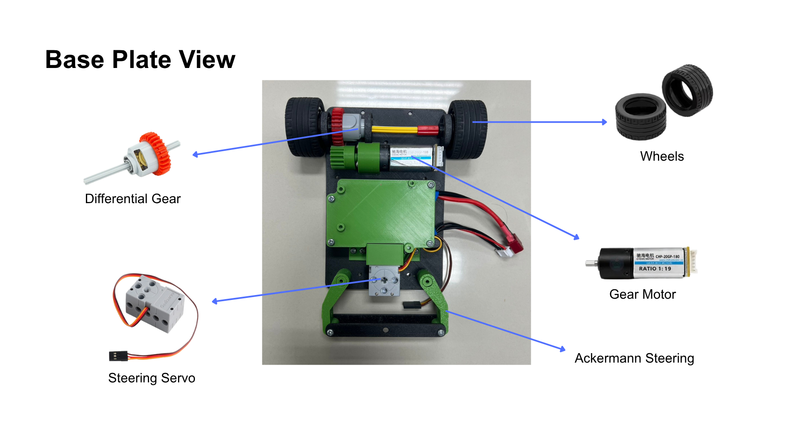
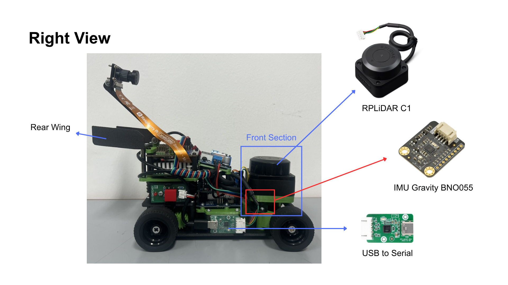
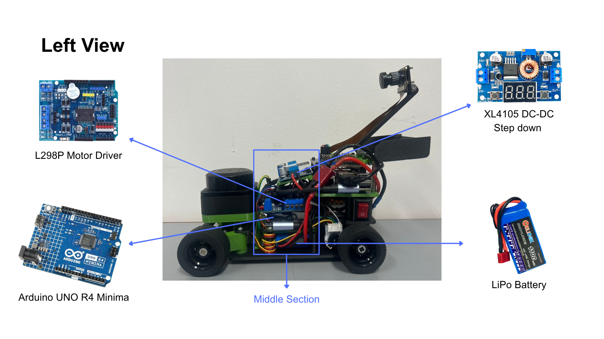
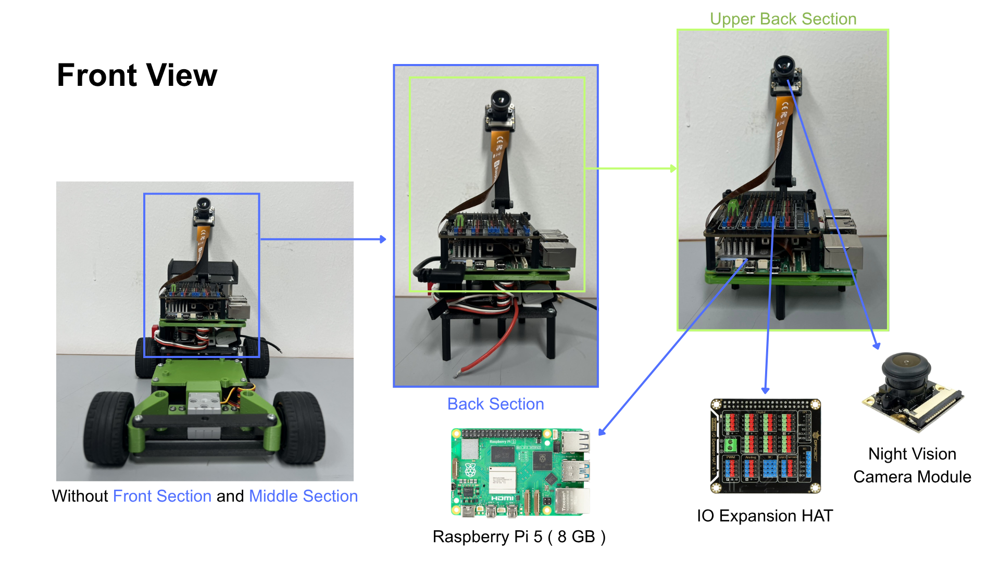
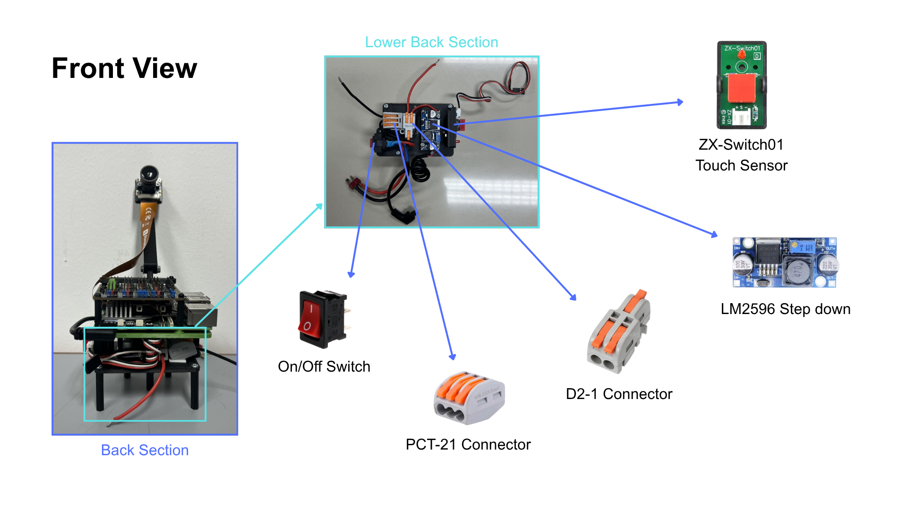

# Electrical, Power & Sensor Architecture

This document describes the complete electrical and sensing architecture of the **YBR-SUNFLOWER WRO 2026 Future Engineers robot**, including the power system, controllers, communication interfaces, sensors, physical sensor placement, wiring, calibration and initialization methods, development iterations, failure modes, reliability decisions, and final electrical configuration.

The purpose of this document is not only to identify the components used in the robot, but also to explain:

- why each electrical and sensing component was selected,
- how power is generated, regulated, and distributed,
- how current demand influenced the power architecture,
- why different sensors are used for different types of information,
- why each sensor is placed in its final physical position,
- how the sensors are calibrated or initialized,
- what electrical and sensing problems were discovered during development,
- how testing changed the final architecture,
- what failure modes were considered,
- how electrical, mechanical, and software decisions affect one another,
- and how the final system can be reproduced.

---

# Contents

1. [Electrical Engineering Overview](#1-electrical-engineering-overview)
2. [Electrical Design Requirements and Constraints](#2-electrical-design-requirements-and-constraints)
3. [Power Architecture](#3-power-architecture)
4. [Power Budget and Electrical Load Analysis](#4-power-budget-and-electrical-load-analysis)
5. [Controllers and Communication Architecture](#5-controllers-and-communication-architecture)
6. [Sensor Architecture and Selection](#6-sensor-architecture-and-selection)
7. [Sensor Placement and Field-Based Reasoning](#7-sensor-placement-and-field-based-reasoning)
8. [Calibration, Initialization and Signal Quality](#8-calibration-initialization-and-signal-quality)
9. [Interface and Pin Assignment](#9-interface-and-pin-assignment)
10. [Wiring Architecture](#10-wiring-architecture)
11. [Electrical and Sensor Development — V1 to V3](#11-electrical-and-sensor-development--v1-to-v3)
12. [Testing and Reliability Iteration](#12-testing-and-reliability-iteration)
13. [Failure Modes, Noise and Risk Mitigation](#13-failure-modes-noise-and-risk-mitigation)
14. [System-Level Engineering Decisions and Trade-offs](#14-system-level-engineering-decisions-and-trade-offs)
15. [Final Electrical Configuration](#15-final-electrical-configuration)
16. [Electrical Reproducibility](#16-electrical-reproducibility)
17. [References](#17-references)

---

# 1. Electrical Engineering Overview

The final electrical system combines high-level computing, low-level actuator control, multiple sensing modalities, and two power branches into one integrated architecture.

The electrical system can be divided into five functional groups:

1. **Power generation and distribution**
2. **High-level computing**
3. **Low-level control**
4. **Sensing**
5. **Actuation and feedback**

The final architecture uses:

- Raspberry Pi 5
- DFR0566 IO Expansion HAT
- Arduino UNO R4 Minima
- RPLiDAR C1
- Raspberry Pi Night Vision Camera
- Gravity BNO055 IMU
- CHP-20GP-180 motor encoder
- L298P Motor Shield
- GEEKSERVO steering servo
- 3S LiPo battery
- LM2596 step-down converter
- XL4015 step-down converter
- D1-2 positive distribution connector
- PCT-21 ground distribution connector
- SPST main power switch
- ZX-Switch01 competition start switch

---

## 1.1 Final Electrical Hardware Layout

| Base Plate | Front Section | Middle Section |
|---|---|---|
|  |  |  |

| Upper Back Section | Lower Back Section |
|---|---|
|  |  |

The annotated photographs show the physical relationship between the controllers, sensors, power electronics, actuators, and wiring in the Version 3 robot.

These images should be used together with the schematic and wiring diagrams later in this document.

---

## 1.2 Hardware Roles

| Component | Electrical / System Role |
|---|---|
| Raspberry Pi 5 | High-level perception, localization, navigation, and autonomous decision-making |
| DFR0566 IO Expansion HAT | Raspberry Pi peripheral breakout and organized I/O interface |
| Arduino UNO R4 Minima | Low-level drive, steering, encoder, and start-button control |
| RPLiDAR C1 | 2D environmental-distance sensing |
| Raspberry Pi Night Vision Camera | Visual sensing and traffic-pillar detection |
| Gravity BNO055 IMU | Relative heading and orientation reference |
| CHP-20GP-180 Encoder | Drive-motor rotation feedback |
| CHP-20GP-180 Motor | Main drivetrain actuator |
| L298P Motor Shield | Drive-motor control |
| GEEKSERVO | Steering actuator |
| 3S LiPo Battery | Main onboard electrical energy source |
| LM2596 | Raspberry Pi-side voltage conversion |
| XL4015 | Motor/control-side voltage conversion |
| D1-2 | Positive power distribution |
| PCT-21 | Common negative / ground distribution |
| SPST Switch | Main robot power control |
| ZX-Switch01 | Competition start input |

---

## 1.3 Criterion 2 Evidence Map

| Level 6 Requirement | Evidence in This Document |
|---|---|
| Power-system architecture | Sections 3 and 10 |
| Power-budget analysis | Section 4 |
| Current-distribution reasoning | Sections 3.4 and 4 |
| Sensor-selection trade-offs | Section 6 |
| Field-based sensor placement | Section 7 |
| Calibration / setup methods | Section 8 |
| Noise / interference considerations | Sections 8.6 and 13 |
| Failure-point analysis | Section 13 |
| Reliability-focused iteration | Sections 11 and 12 |
| Wiring reproducibility | Sections 9, 10 and 16 |
| System-level trade-offs | Section 14 |

---

# 2. Electrical Design Requirements and Constraints

The electrical architecture must support the complete autonomous vehicle while operating from one onboard battery.

The major electrical requirements are:

- provide stable power to the Raspberry Pi,
- provide sufficient power for the motor and steering system,
- support several sensors with different interfaces,
- maintain a common electrical reference,
- isolate sensitive computing loads as much as practical from rapidly changing actuator loads,
- allow reliable Raspberry Pi ↔ Arduino communication,
- maintain accessible wiring and connectors,
- fit inside the compact mechanical structure,
- initialize safely before the competition start command,
- and remain serviceable during testing.

---

## 2.1 Main Electrical Constraints

| Constraint | Engineering Response |
|---|---|
| Single main onboard battery | Use voltage-conversion stages for different electrical requirements |
| Battery voltage changes during discharge | Use step-down conversion instead of supplying sensitive electronics directly |
| Raspberry Pi sensitive to supply instability | Dedicated computing power branch |
| Motor / servo current changes rapidly | Separate actuator-related power branch from Pi branch |
| Limited chassis space | Layered electrical mounting |
| Multiple Pi peripherals | DFR0566 I/O Expansion HAT |
| Different sensor interfaces | CSI, USB Serial and I²C used according to device |
| Competition start procedure | Separate main ON/OFF switch and start button |
| LiDAR requires planar sensing | Rigid, approximately level mounting |
| Camera depends on field visibility | Elevated adjustable camera structure |
| IMU absolute magnetic heading not required | Relative heading initialization |
| Need for repeatable assembly | Documented pin assignments, schematic and wiring diagram |

---

# 3. Power Architecture

## 3.1 Main Battery

The complete robot uses one **3S LiPo battery** as its primary power source.

| Specification | Value |
|---|---|
| Battery type | LiPo |
| Configuration | 3S |
| Nominal voltage | 11.1 V |
| Fully charged voltage | Approximately 12.6 V |
| Capacity | 1100 mAh |
| Exact manufacturer / model | Helicox |

The nominal 11.1 V value does not mean that the battery remains at exactly 11.1 V throughout a run.

A 3S LiPo reaches approximately 12.6 V when fully charged and decreases in voltage as energy is used.

Because the battery voltage is variable and is higher than the supply required by several electronic subsystems, regulated voltage conversion is required.

---

## 3.2 High-Level Power Distribution

The final design divides the battery supply into two principal branches:

```text
                    3S LiPo Battery
                     11.1 V nominal
                           |
                     Main Power Switch
                           |
                 Positive Distribution
                        (D1-2)
                           |
              +------------+------------+
              |                         |
              v                         v
           LM2596                    XL4015
              |                         |
              v                         v
       Computing Branch          Motor / Control Branch
              |                         |
        Raspberry Pi 5          Arduino / Motor System
              |
       DFR0566 + Pi-side
          peripherals
```

The negative side of the electrical system is distributed through the **PCT-21 common-ground connector**.

All connected subsystems therefore share a common electrical reference.

---

## 3.3 Computing Branch

The computing branch supplies the Raspberry Pi and its Pi-side interface electronics.

```text
3S LiPo
   |
   v
LM2596
   |
Approximately 5.1 V
   |
Raspberry Pi 5
   |
DFR0566 IO Expansion HAT
```

The LM2596 output is adjusted to approximately **5.1 V**.

The slightly increased voltage relative to an ideal 5.0 V supply is intended to compensate for voltage losses through connectors and wiring before power reaches the Raspberry Pi.

The Raspberry Pi supply is separated from the motor/control branch because the Pi is more sensitive to short supply-voltage disturbances than the mechanical actuators.

---

### 3.3.1 Raspberry Pi Supply Validation

The Raspberry Pi 5 has a load-dependent current requirement.

Its actual consumption depends on:

- CPU load,
- connected USB devices,
- camera activity,
- peripherals,
- and software workload.

For this reason, the completed robot should be validated under representative competition load rather than assuming a fixed Raspberry Pi current.

> **[TODO: Measure Raspberry Pi-branch voltage and current while running the final Obstacle Challenge software with LiDAR, camera, IMU and Arduino connected.]**

Recommended measurements:

| Condition | Pi Rail Voltage | Pi Rail Current |
|---|---:|---:|
| Idle after startup | **[TODO]** | **[TODO]** |
| LiDAR + camera active | **[TODO]** | **[TODO]** |
| Full navigation software | **[TODO]** | **[TODO]** |
| Highest observed load | **[TODO]** | **[TODO]** |

This is more useful for validating the actual robot than relying only on the maximum capability published for the Raspberry Pi power interface.

---

## 3.4 Motor / Control Branch

The second branch supplies the motor/control-side system through the XL4015.

```text
3S LiPo
   |
   v
XL4015
   |
   v
Motor / Control System
```

The exact final XL4015 output setting must be documented consistently because earlier repository documents contain two different values.

The existing `elec_README.md` previously described this branch as approximately **5 V**, while the current `BUILD.md` describes the XL4015 as adjusted to approximately **11.1 V**.

> **[TODO: Measure the actual XL4015 output voltage on the completed Version 3 robot and update every document to the same value.]**

> **[TODO: Confirm exactly which devices are powered from the XL4015 output: motor-power rail, L298P Motor Shield, Arduino supply, steering-servo rail, or a combination of these.]**

Until this measurement is confirmed, this document intentionally does not claim a specific final XL4015 output voltage.

---

### 3.4.1 Why the Branches Are Separated

Drive motors and steering servos do not draw constant current.

Their current changes during:

- acceleration,
- deceleration,
- steering movement,
- mechanical loading,
- and near-stall conditions.

If sensitive computing electronics and actuators depend on the same unregulated or poorly isolated supply path, these rapid changes can create voltage disturbances.

Our final architecture therefore separates the Raspberry Pi power conversion from the motor/control-side conversion.

The design objective is:

> **Reduce the electrical interaction between high-current actuator behavior and the Raspberry Pi computing supply.**

---

## 3.5 Power Distribution Hardware

The final power-distribution structure uses:

### D1-2

Used for **positive power distribution**.

### PCT-21

Used for **negative / common-ground distribution**.

This provides a more organized and reproducible power layout than joining several wires through undocumented temporary connections.

---

# 4. Power Budget and Electrical Load Analysis

A power budget is required because selecting a battery or voltage converter only from its nominal voltage is not sufficient.

The electrical design must also consider:

- continuous current,
- transient current,
- stall current,
- converter capability,
- voltage drop,
- and simultaneous subsystem operation.

---

## 4.1 Reference Load Table

The table below distinguishes between **reference specifications** and **values**.

| Component | Supply | Reference / Known Current | Peak / Stall | Evidence Type |
|---|---:|---:|---:|---|
| Raspberry Pi 5 | ~5.1 V input branch | Load dependent | Load dependent | Must be measured on final robot |
| RPLiDAR C1 | 5 V | ~290 mA reference | Load dependent | Manufacturer reference |
| Camera | 5 V | **[TODO: Verify exact current for final camera module]** | **[TODO]** | Exact final module not yet confirmed here |
| BNO055 module | Pi-side I²C supply | **[TODO: Verify current for SEN0253 complete module]** | — | Exact board current should be taken from module documentation |
| DFR0566 IO HAT | 5 V | Load dependent | — | Depends on attached peripherals |
| Arduino UNO R4 Minima | Control-side supply | Load dependent | — | Depends on connected devices |
| CHP-20GP-180 Motor | Motor-side supply | ≤280 mA no-load / ≤550 mA rated | ≤2.7 A stall | Motor reference specification |
| GEEKSERVO | Approximately 4.8 V nominal | **[TODO: Verify final servo current specification]** | **[TODO: Current documents contain approximately 700–900 mA stall values]** | Conflicting values in current documentation |

---

## 4.2 Why Peak Current Matters

Average current alone is not sufficient for actuator sizing.

For the drive motor:

```text
No-load current < Rated current << Stall current
```

The documented motor values are approximately:

```text
No-load current <= 0.28 A
Rated current  <= 0.55 A
Stall current  <= 2.7 A
```

This means a drivetrain that appears to consume a small amount of current while the wheels spin freely may require several times more current during heavy loading or stall.

Therefore:

> **The motor-side power path must be evaluated for transient and near-stall demand, not only for normal driving current.**

---

## 4.3 Power-Budget Method

For a DC load:

```text
Electrical Power = Voltage x Current

P = V x I
```

For each branch, the design process should compare:

```text
Expected simultaneous load
        <
Converter / wiring capability
```

with additional margin for short transients.

---

## 4.4 Final Measured Power Budget

The strongest validation is measurement of the completed robot.

> **[TODO: Add measured current values before final submission if time permits.]**

### Computing Branch

| Test Condition | Voltage | Current | Power |
|---|---:|---:|---:|
| Pi idle | **[TODO]** | **[TODO]** | **[TODO]** |
| Sensors active | **[TODO]** | **[TODO]** | **[TODO]** |
| Full competition software | **[TODO]** | **[TODO]** | **[TODO]** |

### Motor / Control Branch

| Test Condition | Voltage | Current | Power |
|---|---:|---:|---:|
| Motor stopped | **[TODO]** | **[TODO]** | **[TODO]** |
| Normal straight driving | **[TODO]** | **[TODO]** | **[TODO]** |
| Acceleration | **[TODO]** | **[TODO]** | **[TODO]** |
| Steering while driving | **[TODO]** | **[TODO]** | **[TODO]** |
| Highest observed load | **[TODO]** | **[TODO]** | **[TODO]** |

These measurements would allow the power architecture to be validated quantitatively rather than only from component specifications.

---

# 4.5 Battery Runtime

Battery capacity is:

```text
1100 mAh = 1.1 Ah
```

However, simple runtime calculations using:

```text
Runtime = Capacity / Current
```

are only rough estimates because the complete robot current is not constant.

Current changes with:

- drivetrain load,
- steering activity,
- CPU workload,
- camera processing,
- LiDAR operation,
- and battery voltage.

For this reason, actual competition runtime should be validated experimentally.

> **[TODO: Record the actual usable operating time of the fully charged final robot under representative autonomous driving.]**

---

# 5. Controllers and Communication Architecture

The robot separates high-level autonomous computation from low-level actuator control.

```text
Sensors
   |
   v
Raspberry Pi 5
   |
   | USB Serial
   | 115200 baud
   v
Arduino UNO R4 Minima
   |
   +--> Drive Motor
   |
   +--> Steering Servo
   |
   +<-- Encoder
   |
   +<-- Start Button
```

---

## 5.1 Raspberry Pi 5

**Purpose:** High-level perception, localization and navigation.

The Raspberry Pi processes information from:

- RPLiDAR C1,
- camera,
- BNO055 IMU,
- and the autonomous software architecture.

Its high-level responsibilities include:

- sensor processing,
- localization,
- computer vision,
- field-position estimation,
- path generation,
- obstacle mapping,
- navigation,
- and generating drive / steering requests.

The Raspberry Pi does not directly perform every low-level actuator operation.

Instead, actuator requests are sent to the Arduino.

---

## 5.2 DFR0566 IO Expansion HAT


**Purpose:** Raspberry Pi peripheral interface and organized GPIO breakout.

The DFR0566 exposes Raspberry Pi interfaces including:

- digital I/O,
- analog input,
- PWM,
- I²C,
- UART,
- SPI,
- IIS.

It also provides DFRobot Gravity-compatible connections.

In our robot, the HAT acts as a structured Raspberry Pi-side interface layer.

The reason for using the board is not additional computing capability.

Its purpose is mainly to:

- simplify physical Raspberry Pi wiring,
- reduce direct loose connections to the Pi GPIO header,
- provide convenient connectors,
- organize peripheral interfaces,
- and improve reproducibility.

---

### 5.2.1 Interface Role

The camera and LiDAR use their own Raspberry Pi interfaces.

The HAT is mainly important for Raspberry Pi-side GPIO / I²C peripherals such as the IMU and other connections that benefit from an organized breakout.

---

## 5.3 Arduino UNO R4 Minima

**Purpose:** Low-level actuator and interface controller.

The Arduino handles:

- drive-motor control,
- steering-servo control,
- quadrature encoder input,
- competition start switch,
- and command reception from the Raspberry Pi.

Separating these responsibilities from the Raspberry Pi provides a clear control boundary:

```text
Raspberry Pi
= decide what the robot should do

Arduino
= execute actuator commands
```

---

## 5.4 Raspberry Pi ↔ Arduino Communication

The two controllers communicate through **USB Serial**.

| Parameter | Value |
|---|---|
| Physical interface | USB |
| Default Raspberry Pi device | `/dev/ttyACM0` |
| Baud rate | `115200` |
| Protocol | Newline-terminated ASCII |
| Basic command | `<servoAngle>,<speed>,<distance>` |

Example:

```text
30,55,0
```

The detailed software interpretation of these messages is documented in:

[`../software/software_README.md`](../software/software_README.md)

---

### 5.4.1 Response Messages

| Response | Meaning |
|---|---|
| `READY` | Arduino initialized |
| `Start` | Competition start button triggered |
| `OK` | Continuous-drive command accepted |
| `t` | Requested distance movement completed |
| `ERR` | Invalid / malformed command |

These response messages allow the Raspberry Pi to determine whether the low-level controller has initialized and whether specific operations have completed.

---

# 6. Sensor Architecture and Selection

No single sensor provides all the information required by the robot.

The final sensing architecture therefore combines several sensors with different strengths.

```text
                 FINAL SENSOR ARCHITECTURE

      RPLiDAR C1       Camera       BNO055
          |               |            |
          |               |            |
          +-------+-------+------------+
                  |
                  v
             Raspberry Pi
                  |
                  v
              Navigation

Motor Encoder ------------------> Arduino
Start Button -------------------> Arduino
```

---

## 6.1 Sensor Selection Requirements

The autonomous system requires four different categories of information:

| Required Information | Sensor |
|---|---|
| Environment geometry / distance | RPLiDAR C1 |
| Traffic-pillar color / vision | Camera |
| Orientation / heading reference | BNO055 |
| Motor rotation / movement feedback | Encoder |

This is why the final system uses multiple sensing modalities.

---

## 6.2 Sensor Trade-off Summary

| Final Sensor | Earlier / Alternative Approach | Advantage of Final Choice | Trade-off |
|---|---|---|---|
| RPLiDAR C1 | Multiple ultrasonic sensors | 2D environmental information over many angles | Greater software and interface complexity |
| Camera | Distance sensors alone | Can identify red / green visual information | Sensitive to lighting, exposure and field of view |
| BNO055 | Orientation from environment alone | Independent short-term orientation reference | Absolute heading can be affected by calibration / magnetic environment |
| Encoder | Open-loop PWM only | Direct motor-rotation feedback | Requires decoding and wiring |
| DFR0566 interface | Direct Pi GPIO wiring | Organized repeatable connections | Additional board / physical space |

---

## 6.3 Camera — Raspberry Pi Night Vision Camera


**Purpose:** Visual traffic-pillar sensing.

The camera provides essential information that cannot be obtained from LiDAR distance data alone. While LiDAR can detect the presence and distance of an object, it cannot identify its color, such as whether a WRO traffic pillar is **red or green**. Therefore, the camera is used to provide the color information needed for the robot to correctly respond to the Obstacle Challenge.

---

### 6.3.1 Why a Camera Is Necessary

```text
LiDAR:
Object exists
Distance / geometry

Camera:
Object color
Visual appearance
```

Therefore, the two sensors serve different purposes. This allows them to complement each other rather than duplicate the same function.

---

### 6.3.2 Camera Field of View Development

The original lens provided a relatively narrow visible area.

A wider-angle lens was installed to increase the amount of field visible to the camera.

However, two current documents contain different field-of-view values:

- the electrical documentation previously described approximately **60° FOV**,
- while the current software camera-distance calculation contains an **80° horizontal FOV calibration value**.

> **[TODO: Measure or confirm the final effective horizontal camera FOV and use the same value in both `elec_README.md` and `software_README.md`.]**

Until this is confirmed, this document intentionally does not claim one of those values as the final measured FOV.

---

## 6.4 RPLiDAR C1


**Purpose:** 2D environmental-distance sensing.

The RPLiDAR C1 provides distance measurements around the vehicle, allowing the software to understand the robot’s surroundings and detect nearby objects.

Its information is used by the software for:

- wall geometry,
- environmental awareness,
- clearance checking,
- localization,
- and navigation.

### Interface

```text
USB Serial
Default device: /dev/ttyUSB0
Baud rate: 460800
```

---

### 6.4.1 Why LiDAR Replaced Ultrasonic Sensors

The initial sensing concept relied on ultrasonic sensors, which provided distance measurements in individual directions. However, the final navigation strategy required more detailed spatial information around the robot.

The LiDAR provides a 2D scan of the surrounding field and therefore better supports:

- wall geometry,
- orientation matching,
- position estimation,
- and localization on the known WRO field.

As a result, the sensor architecture was changed from discrete ultrasonic measurements to LiDAR-based environmental sensing.

---

## 6.5 BNO055 IMU — Gravity 10 DOF IMU AHRS


The robot uses the **DFRobot Gravity 10 DOF IMU AHRS BNO055 + BMP280 (SEN0253)**.

**Purpose:** Relative heading and orientation reference.

TThe BNO055 combines data from its built-in accelerometer, gyroscope, and magnetometer to calculate the robot’s orientation. It then provides fused orientation data to the Raspberry Pi, allowing the system to monitor the robot’s heading and movement more reliably.


### Interface

```text
I²C
Raspberry Pi hardware I²C
via DFR0566 interface
```

---

### 6.5.1 Why the IMU Is Used

LiDAR localization provides information about the robot’s position relative to the field geometry, while the IMU provides an independent reference for its orientation. These two sources complement each other to improve the robot’s overall navigation. Instead of relying on geographic North as the primary reference, the software mainly determines the robot’s orientation relative to its starting direction and combines this with LiDAR-based localization to navigate the known WRO field.

---

## 6.6 Motor Encoder — CHP-20GP-180


**Purpose:** Drive-motor rotation feedback.

The motor is equipped with a dual-channel Hall-effect encoder that generates two signals for tracking the motor’s rotation. The Arduino reads both encoder channels using quadrature decoding, allowing the system to determine the direction and amount of motor rotation for more precise movement control.

Existing documentation uses:

```text
Motor gearbox ratio = 19:1
Encoder PPR         = 11
Quadrature          = x4
```

giving:

```text
19 x 11 x 4 = 836 counts
```

> **[TODO: Verify from the exact motor/encoder datasheet whether the stated 11 PPR value is specified per pre-gear motor revolution and confirm that 836 should be described as counts per geared-output revolution.]**

This distinction should be documented accurately because the encoder is physically associated with the motor before or within the gearbox assembly.

---

### 6.6.1 Why Encoder Feedback Is Useful
Without an encoder, the control system only knows the PWM signal sent to the motor, which does not guarantee a specific physical rotation. 

Actual motor movement can vary depending on factors such as:

- battery voltage,
- friction,
- mechanical load,
- and acceleration.

Encoder feedback provides the controller with direct information about the motor’s actual rotation, allowing for more accurate and consistent movement. This is especially important for controlled-distance movement, precise parking, and achieving repeatable drivetrain performance.

---

## 6.7 ZX-Switch01 Competition Start Switch


**Purpose:** Physical competition-start input.

The start switch is connected to the Arduino and allows the robot to remain powered and fully initialized while waiting for the official start command. Once the start signal is given, the Arduino can trigger the robot’s programmed operation.

Current pin assignment:

```text
Arduino A0
```

The main SPST switch and the competition start switch therefore have different roles:

```text
Main SPST Switch
= electrical power

ZX-Switch01
= begin autonomous run
```

---

## 6.8 Removed Sensor — Light Sensor

The first prototype included a light sensor mounted beneath the front steering structure to detect the blue and orange field markings and help determine when the robot should turn. However, after the navigation architecture was changed to LiDAR-based localization, the information provided by the light sensor was no longer necessary. The sensor was therefore removed from the final sensing architecture. This shows that the final sensor configuration was not simply created by adding more sensors, but by evaluating the role of each sensor and removing those whose information became redundant.

---

# 7. Sensor Placement and Field-Based Reasoning

Sensor placement directly affects measurement quality.

A correct electrical connection alone is not sufficient to ensure reliable sensor operation. Sensors must also be mounted at the appropriate height, angle, orientation, and position so that they can accurately collect the information required by the robot’s control and navigation systems.

---

## 7.1 Placement Summary

| Sensor | Final Placement | Main Placement Reason |
|---|---|---|
| Camera | Upper section | Clearer view of traffic pillars / field |
| RPLiDAR C1 | Elevated front / upper structure | Clear scan and approximately horizontal 2D sensing plane |
| BNO055 | Under LiDAR | Efficient use of space and reduced wiring congestion |
| Encoder | Integrated with drive motor | Direct drivetrain feedback |
| Start Switch | Accessible external position | Competition start operation |
| DFR0566 | Directly on Raspberry Pi | Short organized peripheral interface |

---

## 7.2 Camera Placement

The camera is mounted above most of the robot’s structure to minimize obstruction from the chassis, steering components, wiring, and other electronics. This elevated position provides the visual system with a clearer view of the field and traffic pillars. 

The camera mount is also mechanically adjustable, allowing its viewing angle to be changed without redesigning the entire chassis. This flexibility is important because camera performance can be affected by both the field geometry and the lighting conditions during competition.


> **[TODO: Add measured final camera height above the field.]**

> **[TODO: Add measured final camera downward / upward angle if available.]**

---

## 7.3 LiDAR Placement

The WRO field is primarily planar, while the LiDAR produces a 2D scan within a specific sensing plane. To accurately represent the walls and surrounding objects, the LiDAR must be mounted so that its scanning plane remains approximately parallel to the field surface. This ensures that the distance measurements are consistent and useful for localization and navigation.


---

### 7.3.1 Development Problem

In an earlier robot configuration, the LiDAR was mounted at an excessive angle relative to the ground, causing its 2D scanning plane to intersect the surrounding environment at inconsistent heights. As a result, the environmental data did not accurately represent the expected top-down geometry of the WRO field, reducing the reliability of LiDAR-based localization and navigation.


---

### 7.3.2 Final Change

The LiDAR was repositioned closer to parallel with the field.

```text
Before:
Tilted LiDAR plane
        /
       /
------/---------- Field

After:
---------------- LiDAR scan plane
---------------- Field
```

This improved the usefulness of LiDAR measurements for 2D localization.

> **[TODO: If available, add the final measured LiDAR mounting angle or a level-reference photograph.]**

---

## 7.4 IMU Placement

The BNO055 was originally mounted beside the Raspberry Pi I/O Expansion HAT. Although this configuration worked electrically, it created a crowded electronics area with limited space for wiring and component organization. 

In the redesigned robot, the IMU was moved underneath the LiDAR to make better use of the available space, reduce wiring congestion around the Raspberry Pi, and achieve a cleaner integration with the final mechanical structure. 

This position also places the IMU farther from some of the dense electronics and power wiring around the Raspberry Pi. Since the BNO055 includes a magnetometer, nearby magnetic fields may affect heading measurements; 

> however, we do not claim that the final IMU position completely eliminates magnetic interference because this effect has not been quantitatively measured.

---

# 8. Calibration, Initialization and Signal Quality

It is important to distinguish between **calibration** and **initialization**. 

**Calibration** involves adjusting a measurement system so that its readings more accurately reflect real-world values, while **initialization** establishes a reference for the sensors when the robot starts operating. These processes serve different purposes, and the sensors used in our robot do not all rely on the same method.

---

## 8.1 Calibration / Initialization Summary

| Device | Main Method |
|---|---|
| Camera | FOV / visual-threshold configuration |
| LiDAR | Physical mounting alignment |
| BNO055 | Startup settling + relative heading initialization |
| Encoder | Counts / rotation relationship |
| Steering relationship | Software / mechanical calibration documented in software/mechanical sections |

---

## 8.2 Camera Configuration

The main camera hardware change was replacing the original narrow lens with a wider-angle configuration. On the software side, red and green traffic-pillar detection uses color thresholds tuned from actual camera images rather than assuming ideal RGB values.

Lighting remains an important source of uncertainty. The current software therefore includes tools that allow HSV values to be sampled from real images and used to adjust the detection ranges.

Detailed image-processing calibration is documented in: [`../software/software_README.md`](../software/software_README.md)

---

## 8.3 LiDAR Alignment

The primary hardware-side LiDAR calibration is physical orientation.

```text
Problem:
LiDAR scan plane tilted relative to field

Change:
Reposition sensor closer to horizontal

Result:
2D scan corresponds more closely to field geometry
```

The LiDAR does not require the same type of startup reference as the IMU. Instead, its distance measurements are interpreted by the navigation software in relation to the known geometry of the WRO field, allowing the robot to determine its position and navigate based on the surrounding field structure.

---

## 8.4 BNO055 Initialization and Relative Heading

The robot does **not** perform a complete magnetometer-calibration routine before every competition run. This is intentional because the navigation system does not require geographic North; it needs a useful orientation reference relative to the robot's starting direction.

---

### 8.4.1 Startup Settling

After communication with the BNO055 is established, the software waits approximately:

```text
BOOT_SETTLE_S = 1.0 s
```

This gives the BNO055 fusion output a short period to settle before it is used.

---

### 8.4.2 Initial Heading Capture

After the competition start condition is triggered, the current heading is stored as the initial reference.

```text
Raw BNO055 heading
        |
        v
Capture at start
        |
        v
Initial heading reference
        |
        v
Relative navigation
```

For example:

```text
Raw startup heading = 37 degrees

Robot local reference = starting direction

90-degree clockwise target
= initial heading + 90 degrees
```

The exact raw numerical heading is less important than the difference from the starting orientation.

---

### 8.4.3 Field-Coordinate Offset

The localization software can also apply a compass offset when relating raw IMU orientation to the field coordinate system.

Conceptually:

```text
Field Heading
=
Compass Sign x Raw IMU Heading
+
Compass Offset
```

`compass_sign` accounts for the physical sensor orientation and direction convention.

This is a coordinate convention rather than a full magnetometer calibration.

---

### 8.4.4 IMU Limitation

Because the system does not wait for a complete magnetometer calibration before every run, absolute heading should not be treated as perfectly reliable over long periods or in every magnetic environment.

Therefore, the software does not rely on the IMU as the only source of localization.

Instead, LiDAR-based field geometry provides an additional reference for determining the robot’s orientation and position, improving the overall reliability of navigation.

---

## 8.5 Encoder Calibration / Interpretation

The conversion between encoder signals and physical rotation depends on the encoder pulses per revolution, quadrature decoding factor, and gearbox ratio.

Existing documentation calculates:

```text
11 PPR x 4 quadrature x 19 gearbox

= 836 counts
```

> **[TODO: Verify the exact reference revolution for this value and rename the unit correctly throughout the code documentation.]**

Once verified, this relationship can be used to convert encoder counts into drivetrain rotation.

---

## 8.6 Noise, Interference and Environmental Effects

The final sensor and power architecture considers several different sources of measurement or electrical instability.

| Source | Possible Effect | Design / Software Response |
|---|---|---|
| Motor-current transient | Pi supply disturbance | Separate power branches |
| Wiring voltage drop | Reduced Pi input voltage | Pi branch adjusted to ~5.1 V |
| Camera lighting / shadow | Color-classification error | HSV tuning and adjustable camera configuration |
| Auto-exposure variation | Changing color appearance | Identified as software limitation / improvement area |
| LiDAR mounting tilt | Incorrect 2D geometry | Mechanical remounting |
| Magnetic interference near IMU | Heading error | IMU placement + LiDAR cross-reference |
| Sensor unavailable | Missing navigation information | Software device checks / degraded behavior where supported |
| Encoder electrical noise / incorrect counts | Motion-estimation error | Quadrature decoding and documented wiring |

Not all of these effects have been measured quantitatively. Therefore, when quantitative evidence is unavailable, they are documented as **risk considerations** rather than being presented as proven reductions in failure or error rates.


---

# 9. Interface and Pin Assignment

## 9.1 Arduino Pin Assignment

| Function | Arduino Pin |
|---|---|
| Encoder A | D2 |
| Encoder B | D3 |
| Motor PWM | D11 |
| Motor Direction | D13 |
| Steering Servo | D9 |
| Competition Start Switch | A0 |
| Pi Communication | USB |

The encoder uses both channels to detect the motor’s rotation and direction. The drive motor uses PWM to control its power and a digital signal to control its direction.

---

## 9.2 Raspberry Pi Device Interfaces

| Device | Interface | Default Device / Bus |
|---|---|---|
| Arduino UNO R4 Minima | USB Serial | `/dev/ttyACM0` |
| RPLiDAR C1 | USB Serial | `/dev/ttyUSB0` |
| BNO055 | I²C | Raspberry Pi I²C / DFR0566 |
| DFR0566 | Raspberry Pi GPIO header | Pi header |
| Camera | CSI | Raspberry Pi camera interface |


---

## 9.3 Motor Encoder Wiring

Current documented encoder wiring:

| Wire | Function |
|---|---|
| Red | Motor Power + |
| Black | Hall Sensor GND |
| Yellow | Encoder Signal B |
| Green | Encoder Signal A |
| Blue | Hall Sensor 5 V |
| White | Motor Power - |


---

# 10. Wiring Architecture

## 10.1 Schematic Diagram


The schematic documents the electrical relationships between:

- battery,
- main switch,
- power distribution,
- LM2596,
- XL4015,
- Raspberry Pi,
- DFR0566,
- Arduino,
- motor driver,
- motor,
- servo,
- encoder,
- sensors,
- start button,
- common ground.

The final positive and negative distribution structure is:

```text
Positive distribution -> D1-2

Negative / Ground -> PCT-21
```

---

## 10.2 Physical Wiring Diagram


The wiring diagram shows how the connections are routed physically inside the robot.

The schematic and wiring diagram have different purposes:

```text
Schematic
= electrical relationship

Wiring Diagram
= physical connection / routing
```

Both should be used when reproducing the system.

---

## 10.3 High-Level Electrical Architecture

```text
                         3S LiPo Battery
                         11.1 V nominal
                                |
                          Main Switch
                                |
                    +-----------+-----------+
                    |                       |
                    v                       v
                 LM2596                  XL4015
                    |                       |
                 ~5.1 V              [TODO: VERIFY]
                    |                       |
                    v                       v
             Raspberry Pi 5          Motor / Control
                    |
                    v
             DFR0566 IO HAT
                    |
                    +----------> BNO055 / Pi I/O

Raspberry Pi 5
     |
     +---------- CSI ----------> Camera
     |
     +---------- USB ----------> RPLiDAR C1
     |
     +---------- USB ----------> Arduino UNO R4
                                      |
                                      +--> Motor Driver
                                      |
                                      +--> Steering Servo
                                      |
                                      +<-- Encoder
                                      |
                                      +<-- Start Switch
```

---

## 10.4 Common Ground

The Raspberry Pi, Arduino, sensors, and control electronics need a common electrical reference for their signals. Therefore, the negative connections are connected through a common-ground system. This is especially important when signals are shared between different power branches.

---

# 11. Electrical and Sensor Development — V1 to V3

The sensing architecture changed significantly during development. The final system was developed gradually, with sensors being added, tested, and removed based on the robot’s actual requirements rather than selecting all of the sensors at the beginning.

---

## 11.1 Version 1 — Initial Sensing Concept


Version 1 used the initial sensing concept:

```text
Camera
+
Ultrasonic Sensors
+
Light Sensor
+
IMU
```

The light sensor was positioned beneath the front steering structure.

The initial idea was:

- camera for visual sensing,
- ultrasonic sensors for front distance,
- light sensor for track-marking information,
- and IMU for orientation.

At this stage, the complete Raspberry Pi autonomous navigation system had not yet been implemented. 

> Therefore, no complete autonomous-performance results are claimed for Version 1.

---

## 11.2 Architecture Change

During development, the sensing strategy changed significantly. The final software required more detailed environmental information to support accurate localization and navigation.

This led to the change:

```text
Ultrasonic + Light Sensor
           |
           v
       RPLiDAR C1
```

The ultrasonic sensors and light sensor were removed as the sensing strategy changed. This was more than a component replacement; it changed the type of information available to the robot. The final system mainly used LiDAR and camera data for navigation and localization.

---

## 11.3 Version 2 — LiDAR-Based Prototype

Version 2 introduced:

- RPLiDAR C1,
- removal of ultrasonic sensors,
- removal of light sensor,
- relocation of BNO055 beneath LiDAR.

The final sensing combination became closer to:

```text
LiDAR
+
Camera
+
IMU
+
Encoder
```

The LiDAR provided environmental geometry that allowed the software to move toward field localization rather than only reacting to local distance measurements.

---

## 11.4 Version 3 — Final Electrical Architecture

Version 3 retained the main V2 sensing concept but rebuilt the physical platform and electrical layout.

Major final changes included:

- final LiDAR mounting orientation,
- final IMU placement,
- final DFR0566 integration,
- final power-distribution structure,
- separated computing and motor/control branches,
- final wiring architecture,
- final component mounting,
- and final start interface.

---

## 11.5 Electrical / Sensor Evolution Summary

| Version | Sensor Architecture | Power / Electrical Change | Reason |
|---|---|---|---|
| V1 | Camera + ultrasonic + light + IMU | Initial architecture | Evaluate first sensing concept |
| V2 | Camera + LiDAR + IMU + encoder | LiDAR integrated | Richer environmental information |
| V3 | Same fundamental sensing set | Final branch separation, wiring and component placement | Improve integration and reliability |

---

# 12. Testing and Reliability Iteration

The electrical and sensing system was developed through repeated testing and evaluation. Most major changes were made to solve problems found during testing rather than for aesthetic purposes.

---

## 12.1 Camera Iteration

```text
Problem:
Visible area too limited with original lens

Change:
Install wider-angle lens

Result:
Larger field area visible to software
```

The exact final effective horizontal FOV remains to be reconciled with the software calibration.

---

## 12.2 LiDAR Iteration

```text
Problem:
LiDAR mounted at excessive angle

Effect:
2D scan geometry did not represent field correctly

Change:
Reposition closer to parallel with field

Result:
Improved 2D environmental representation
```

---

## 12.3 IMU Placement Iteration

```text
Previous:
IMU beside Raspberry Pi / IO HAT

Problem:
Crowded electronics area

Change:
Move IMU under LiDAR

Result:
Cleaner component layout and wiring
```

---

## 12.4 Sensor-Architecture Iteration

```text
Initial:
Camera + Ultrasonic + Light Sensor + IMU

Problem:
Information did not match final localization strategy

Change:
Remove ultrasonic + light sensor
Add LiDAR

Final:
Camera + LiDAR + IMU + Encoder
```

This was one of the major system-level changes in the robot, as the electrical and sensor architecture directly influenced and enabled a different software-navigation architecture.


---

## 12.5 Power Architecture Iteration

The final architecture uses separate conversion paths for the Raspberry Pi and the motor control system. This separation helps reduce the risk of changes in motor current affecting the power supply to the Raspberry Pi.

> **[TODO: Add measured Pi voltage during simultaneous acceleration + steering if possible. This would provide direct reliability evidence for the separated power architecture.]**

---

# 12.6 Testing Evidence Table

| Problem / Test | Observation | Change | Evidence / Result |
|---|---|---|---|
| Camera field of view | Original view too narrow | Wider-angle lens | Larger visible field |
| Camera FOV calibration | Electrical and software values differ | Final measurement required | **[TODO]** |
| LiDAR angle | Scan geometry distorted | Re-level sensor | Improved 2D representation |
| IMU physical location | Electronics area crowded | Relocated under LiDAR | Cleaner layout |
| Ultrasonic architecture | Limited spatial information | Changed to LiDAR | Enabled localization-oriented sensing |
| Light sensor | No longer required | Removed | Simpler final sensor set |
| Pi / actuator power interaction | Potential voltage disturbance | Separate converter branches | **[TODO: measured validation]** |
| Pi supply voltage | Connector/wiring loss | LM2596 adjusted to ~5.1 V | **[TODO: measured loaded voltage]** |
| XL4015 setting | Documentation conflict | Verify physical robot | **[TODO]** |

---

# 13. Failure Modes, Noise and Risk Mitigation

## 13.1 Electrical Failure Modes

| Failure Mode | Possible Cause | Effect | Mitigation |
|---|---|---|---|
| Raspberry Pi undervoltage | Converter drop / wiring loss / high load | Reset or unstable computing | Dedicated branch, ~5.1 V adjustment, load validation |
| Motor-side voltage drop | High current during acceleration / stall | Reduced drive performance | Size branch for transient load and test under load |
| Converter incorrect setting | Adjustment error | Component damage or instability | Measure output before connecting electronics |
| Loose power connector | Vibration / assembly | Intermittent reset | Dedicated connectors and strain management |
| Missing common ground | Wiring error | Invalid signal references | PCT-21 common-ground distribution |
| Motor stall | Mechanical obstruction | High current | Avoid prolonged stall; drivetrain / software handling |
| Servo stall | Steering obstruction | High current / heat | Mechanical limits and current-aware design |
| USB disconnect | Vibration / loose cable | Sensor / controller unavailable | Secure connectors and startup device checks |

---

## 13.2 Sensor Failure Modes

| Sensor / Failure | Effect | Mitigation / Response |
|---|---|---|
| Camera color affected by lighting | Incorrect pillar classification | HSV tuning, adjustable mount, exposure improvement |
| Camera FOV calibration incorrect | Incorrect bearing / distance estimate | Verify final FOV against software |
| LiDAR tilted | Distorted 2D map | Level mounting |
| LiDAR unavailable | Reduced localization capability | Device detection / software handling |
| IMU drift / magnetic error | Heading reference error | LiDAR cross-reference |
| IMU unavailable | Reduced heading information | Software can operate with reduced compass contribution where supported |
| Encoder missed / incorrect counts | Distance error | Quadrature decoding and wiring validation |
| Start button incorrect input | Robot does not start correctly | Pre-run verification |

---

# 13.3 Failure Detection

| Condition | Detection Method |
|---|---|
| Arduino unavailable | `/dev/ttyACM0` / serial initialization |
| LiDAR unavailable | `/dev/ttyUSB0` / LiDAR initialization |
| BNO055 unavailable | I²C initialization / heading read |
| Camera unavailable | Camera initialization failure |
| Encoder incorrect | Rotation test / count direction test |
| Start button incorrect | Arduino start-response test |
| Power rail incorrect | Multimeter before final connection |
| Pi instability | Undervoltage / reset behavior during load test |

---

# 14. System-Level Engineering Decisions and Trade-offs

The electrical architecture affects both the mechanical design and the capabilities of the software. Therefore, the final design includes several deliberate engineering trade-offs to balance these different requirements.

| Decision | Alternative | Benefit | Cost / Trade-off |
|---|---|---|---|
| Separate power branches | One common regulated branch | Reduced interaction between actuator and Pi loads | More converters and wiring |
| LiDAR | Ultrasonic sensors | Rich 2D environmental data | More software complexity |
| Camera + LiDAR | LiDAR alone | Adds pillar color information | Lighting sensitivity |
| Relative IMU initialization | Full startup magnetometer calibration | Fast practical competition startup | Less reliance on absolute magnetic heading |
| DFR0566 | Direct Pi header wiring | Cleaner / repeatable I/O | Additional board and space |
| Encoder motor | Open-loop DC motor | Rotation feedback | More wiring / software |
| Adjustable camera mount | Fixed mount | Faster sensor tuning | Additional mechanical complexity |
| One main battery | Multiple independent batteries | Simpler energy source | Requires careful distribution and conversion |

---

## 14.1 Electrical → Mechanical

Electrical components require physical mounting space.

Examples:

- the Raspberry Pi and HAT require a dedicated structural layer,
- converters require trays / plates,
- the LiDAR must remain level,
- the IMU position changed because of electronics congestion,
- cable routing affects structural placement.

Therefore, electrical packaging influenced the final mechanical design.

---

## 14.2 Electrical → Software

The sensor architecture determines what information the software can use.

The change:

```text
Ultrasonic + Light Sensor
```

to:

```text
LiDAR + Camera + IMU + Encoder
```

enabled a fundamentally different navigation strategy.

LiDAR provides the geometric information required for field localization, while the camera supplies traffic-pillar color information that LiDAR cannot measure. The IMU provides heading context, and the encoder provides information about drivetrain rotation.

The electrical sensor architecture therefore directly enabled the final localization and obstacle-handling software.

---

## 14.3 Mechanical → Electrical / Sensor Quality

Mechanical alignment also affects sensing.

Examples:

```text
LiDAR angle
-> scan geometry

Camera position
-> visible field

IMU position
-> wiring congestion / magnetic environment

Motor alignment
-> mechanical load
-> electrical current
```

This is why sensor placement and electrical design cannot be evaluated independently from the chassis.

---

## 14.4 Most Important Electrical Decision

One of the most important electrical decisions was:

> To use a separated power-distribution architecture rather than treating all loads as one shared low-voltage system.

This was because the Raspberry Pi requires a stable power supply, while the motor and servo can create rapidly changing electrical loads. Therefore, the final architecture uses separate conversion paths for the computing and actuator systems while maintaining a shared ground reference.

---

# 15. Final Electrical Configuration

## Computing

- Raspberry Pi 5
- DFR0566 IO Expansion HAT

## Low-Level Control

- Arduino UNO R4 Minima

## Environmental Sensors

- RPLiDAR C1
- Raspberry Pi Night Vision Camera

## Orientation

- Gravity BNO055 IMU

## Motion Feedback

- CHP-20GP-180 dual-phase encoder

## Actuators

- CHP-20GP-180 drive motor
- GEEKSERVO steering servo

## Motor Control

- L298P Motor Shield

## Main Power

- Helicox 3S 11.1 V LiPo, 1100 mAh

## Power Conversion

- LM2596 — approximately 5.1 V Raspberry Pi branch
- XL4015 — **[TODO: Confirm measured final output and connected loads]**

## Power Distribution

- D1-2 positive distribution
- PCT-21 common negative / ground

## Competition Interface

- SPST main power switch
- ZX-Switch01 start button

---

## 15.1 Final Electrical Unknowns to Resolve

| Item | Required Verification |
|---|---|
| Battery brand | Helix vs Helicox |
| XL4015 output | Measure with multimeter |
| XL4015 loads | Confirm exactly what it powers |
| Camera FOV | 60° documentation vs 80° software calibration |
| Servo current | Conflicting reference values |
| Encoder 836-count unit | Verify PPR / gearbox interpretation |
| Pi loaded rail voltage | Measure during final software |
| Pi branch current | Measure under representative load |

---

# 16. Electrical Reproducibility

The electrical system should be reproduced using:

1. this electrical architecture document,
2. the schematic diagram,
3. the physical wiring diagram,
4. controller pin assignments,
5. the final measured converter settings,
6. manufacturer documentation,
7. the source code,
8. and the complete build guide.

---

## 16.1 Minimum Reproduction Map

```text
MAIN POWER

3S LiPo
   |
Main Switch
   |
D1-2 Positive Distribution
   |
   +--> LM2596 --> ~5.1 V --> Raspberry Pi
   |
   +--> XL4015 --> [VERIFY FINAL VOLTAGE] --> Motor / Control


GROUND

Battery -
LM2596 -
XL4015 -
Controllers / relevant devices
   |
   v
PCT-21 Common Ground
```

---

## 16.2 Controller / Sensor Connections

```text
Raspberry Pi 5
   |
   +--> DFR0566
   |       |
   |       +--> BNO055 via I2C
   |
   +--> Camera via CSI
   |
   +--> RPLiDAR C1 via USB
   |
   +--> Arduino UNO R4 via USB Serial
            |
            +--> Encoder D2 / D3
            |
            +--> Motor D11 / D13
            |
            +--> Servo D9
            |
            +--> Start Switch A0
```

---

## 16.3 Pre-Power Verification

Before connecting sensitive electronics:

```text
1. Complete power wiring
        |
        v
2. Leave Raspberry Pi / Arduino disconnected
        |
        v
3. Connect battery
        |
        v
4. Measure LM2596 output
        |
        v
5. Confirm approximately 5.1 V
        |
        v
6. Measure XL4015 output
        |
        v
7. Confirm documented final setting
        |
        v
8. Power off
        |
        v
9. Connect electronics
```

The detailed physical build sequence is documented in:

[`../BUILD.md`](../BUILD.md)

---

## 16.4 Electrical Verification Checklist

Before the first autonomous run:

- [ ] Battery voltage is within expected operating range
- [ ] Main switch disconnects the robot correctly
- [ ] LM2596 output is verified
- [ ] XL4015 output is verified
- [ ] Ground distribution is continuous
- [ ] Raspberry Pi boots without supply warnings
- [ ] Arduino is detected
- [ ] LiDAR is detected
- [ ] Camera opens correctly
- [ ] BNO055 returns changing heading values
- [ ] Encoder counts in both wheel directions
- [ ] Steering servo centers correctly
- [ ] Motor direction matches software command
- [ ] Start button produces the expected start event
- [ ] No connector becomes unusually hot during a short load test
- [ ] Pi rail remains stable while motor and steering are active

---

# 17. References

| Component / Topic | Reference |
|---|---|
| Raspberry Pi 5 | https://www.raspberrypi.com/products/raspberry-pi-5/ |
| Arduino UNO R4 Minima | https://docs.arduino.cc/hardware/uno-r4-minima |
| RPLiDAR C1 | https://www.slamtec.com/en/C1 |
| Gravity BNO055 + BMP280 | https://www.dfrobot.com/product-1793.html /  |
| DFR0566 IO Expansion HAT | https://wiki.dfrobot.com/dfr0566/docs/22892 |
| Camera | Final camera manufacturer / supplier documentation |
| CHP-20GP-180 | Motor manufacturer / supplier specification |
| LM2596 | https://www.ti.com/product/LM2596 |
| XL4015 | https://www.xlsemi.com/datasheet/XL4015-5A-36V-DC-DC-Converter.pdf |
| L298P Motor Shield | https://www.mouser.com/en/ProductDetail/STMicroelectronics/L298P?qs=lDh9v96ogBZNJERYYNX11w%3D%3D / https://www.instructables.com/Tutorial-L289P-Motor-Driver-and-IR-Sensor/ |

---

## Final Electrical Summary

The final electrical and sensing architecture of YBR-SUNFLOWER developed through several major changes rather than remaining fixed from the first prototype.

The development path can be summarized as:

```text
Initial Sensor Concept
Camera + Ultrasonic + Light Sensor + IMU
                    |
                    v
      Need richer spatial information
                    |
                    v
          LiDAR Architecture
Camera + LiDAR + IMU + Encoder
                    |
                    v
       Final Physical Rebuild
                    |
                    v
Separated Power + Final Sensor Placement
                    |
                    v
       Version 3 Competition Robot
```

The most important final decisions are:

- use one main 3S LiPo battery,
- regulate the computing and motor/control paths separately,
- keep a common electrical ground,
- use LiDAR for environmental geometry,
- use the camera for visual color information,
- use the BNO055 as a relative heading reference,
- use the motor encoder for drivetrain feedback,
- organize Pi-side peripheral wiring through the DFR0566,
- physically level the LiDAR for planar sensing,
- position sensors according to their measurement requirements,
- and document failure modes instead of assuming every component always works correctly.

The electrical system was therefore designed not only to **power the robot**, but to provide the sensing information and electrical reliability required by the complete autonomous system.

The final engineering process follows:

> **Select → Integrate → Test → Identify Failure → Modify → Validate**

rather than documenting only the final wiring configuration.
