# Mechanical Design & Mobility System

This document describes the complete mechanical development of the **YBR-SUNFLOWER WRO 2026 Future Engineers robot**, including the drivetrain, steering system, chassis, structural components, mechanical calculations, material selection, manufacturing process, prototype iterations, testing, trade-offs, and final engineering decisions.

The purpose of this document is not only to show the final mechanical design. It explains why the main components were selected, how torque and speed influenced the drivetrain, why the steering and transmission use their current architecture, and how the robot developed from a previous-generation reference platform into the final Version 3 vehicle.

It also documents the mechanical problems discovered during development, the changes made after testing, the trade-offs accepted by the team, and the information required to reproduce the final mechanical platform.

---

# Contents

1. [Mechanical Engineering Overview](#1-mechanical-engineering-overview)
2. [Mechanical Design Requirements and Philosophy](#2-mechanical-design-requirements-and-philosophy)
3. [Mechanical Development Process — V0 to V3](#3-mechanical-development-process--v0-to-v3)
4. [Final Mechanical Architecture](#4-final-mechanical-architecture)
5. [Drivetrain Engineering](#5-drivetrain-engineering)
6. [Steering System](#6-steering-system)
7. [Structural Design and Final 3D Components](#7-structural-design-and-final-3d-components)
8. [Mechanical Sensor and Electronics Integration](#8-mechanical-sensor-and-electronics-integration)
9. [Manufacturing and Material Selection](#9-manufacturing-and-material-selection)
10. [Mechanical Testing and Iteration](#10-mechanical-testing-and-iteration)
11. [Mechanical Trade-offs and Engineering Decisions](#11-mechanical-trade-offs-and-engineering-decisions)
12. [Mechanical Risks and Failure Modes](#12-mechanical-risks-and-failure-modes)
13. [CAD Files and Reproducibility](#13-cad-files-and-reproducibility)
14. [Final Mechanical Configuration](#14-final-mechanical-configuration)

---

# 1. Mechanical Engineering Overview

The YBR-SUNFLOWER robot uses a four-wheel automotive-style architecture with rear-wheel drive and front-wheel steering.

The final mobility system uses one rear drive motor connected to a rear differential through a custom external gear reduction. The two rear wheels provide propulsion, while the two front wheels are controlled by a servo-driven Ackermann-style steering mechanism. The drivetrain shafts are supported by bearings to improve alignment and reduce friction against printed components.

The mechanical structure is built mainly from modular FDM 3D-printed parts. These include the main chassis, electronics layers, camera structure, LiDAR / IMU mount, drivetrain mounts and steering components. This modular architecture allows individual parts to be redesigned or replaced without rebuilding the complete robot.

Our mechanical design was developed around one central principle:

> **Precision, controllability, stability and repeatability are more important to our application than maximum theoretical speed.**

This principle influenced the motor, drivetrain reduction, wheel choice, steering geometry, bearing system, chassis structure and material selection.

---

## 1.1 Mechanical System at a Glance

| Category | Final Configuration |
|---|---|
| Vehicle layout | Four-wheel automotive-style vehicle |
| Drive architecture | Rear-wheel drive |
| Drive motor | CHP-20GP-180 DC geared motor |
| Internal gearbox | 19:1 reduction |
| External drive gear | Custom 16-tooth 3D-printed gear |
| Differential gear | LEGO Technic 28-tooth differential |
| External reduction | 28 / 16 = 1.75:1 |
| Steering | Ackermann-style front steering |
| Steering actuator | GEEKSERVO 2 kg 360° servo |
| Wheels | LEGO Tire 43.2 × 22 ZR |
| Rear axle support | Ball bearings + custom axle sleeves |
| Main structural materials | ABS and ABS-GF |
| Manufacturing method | FDM 3D printing |
| Main printer | Bambu Lab H2D |

---

## 1.2 Criterion 1 Evidence Map

| Level 6 Requirement | Evidence in This Document |
|---|---|
| Torque and speed reasoning | Section 5 |
| Drivetrain selection | Sections 5.1–5.7 |
| Steering mechanism | Section 6 |
| Component-selection reasoning | Sections 5, 6 and 9 |
| Structural stability | Section 7 |
| Design trade-offs | Section 11 |
| Testing and iteration | Sections 3 and 10 |
| Mechanical failure analysis | Section 12 |
| Reproducible mechanical design | Section 13 |

---

# 2. Mechanical Design Requirements and Philosophy

## 2.1 Mechanical Requirements

The mechanical platform must accelerate smoothly from a stop, maintain a controllable driving speed and respond consistently to repeated steering corrections. It also needs to negotiate the WRO corners, pass traffic pillars with sufficient control and perform low-speed parking maneuvers.

At the same time, the chassis must support the complete computing, power and sensing system without allowing excessive sensor movement. The vehicle must remain compact enough for the competition field while still providing enough structural space for the Raspberry Pi, Arduino, converters, battery, camera, LiDAR and IMU.

These requirements mean that mechanical performance cannot be evaluated only by maximum speed. Low-speed control, steering repeatability, rigidity and component integration are equally important.

---

## 2.2 Main Mechanical Constraints

| Constraint | Effect on Mechanical Design |
|---|---|
| Limited robot footprint | Compact layered chassis |
| Parking requires low-speed precision | Torque prioritized over maximum speed |
| Repeated cornering | Ackermann-style steering and differential |
| Heavy onboard electronics | Rigid multi-layer structure |
| LiDAR requires stable mounting | Dedicated upper sensor support |
| Camera requires tuning | Adjustable camera mechanism |
| 3D-printed drivetrain parts | Material and bearing selection become important |
| Need for rapid redesign | Modular printed components |

---

## 2.3 Design Philosophy

Our initial development showed that the fastest drivetrain is not automatically the most useful drivetrain for an autonomous WRO vehicle.

The robot repeatedly needs to enter corners, make steering corrections, pass close to obstacles and perform precise low-speed movement. If the drivetrain produces high speed but cannot be controlled consistently, the software has less time and less mechanical authority to correct the vehicle.

This led to our main mechanical philosophy:

> **We deliberately accept lower maximum speed when the change increases torque, low-speed controllability, stability and repeatability.**

The drivetrain progression demonstrates this philosophy clearly:

```text
28:28
  ↓
21:28
  ↓
16:28
```

Each step increased the external gear reduction. The theoretical maximum wheel speed decreased, but the available torque multiplication and low-speed controllability increased.

---

# 3. Mechanical Development Process — V0 to V3

The final robot was not created in one design step. Its mechanical architecture developed through a sequence of reference study, prototyping, physical testing and redesign.

```text
V0 — Reference Blueprint
        ↓
V1 — First Team Prototype
        ↓
V2 — Functional Prototype
        ↓
V3 — Final Competition Robot
```

---

## 3.1 V0 — Reference Blueprint / Previous-Generation Robot

> **Important:** V0 was not built as part of the current YBR-SUNFLOWER 2026 development cycle.

V0 refers to the **white robot developed by our senior team in the previous season**. Before starting the current robot, we studied this platform as a mechanical reference.

We did not treat V0 as a design that should simply be copied. Instead, it acted as a starting blueprint that helped us identify mechanical requirements, limitations and questions that should be investigated in the new platform.


> **Figure — V0 reference robot from the previous season. This vehicle was studied as a mechanical reference before the current team began developing V1.**

---

### 3.1.1 Lessons Taken from V0

One of the most important lessons from the previous-generation robot was the relationship between **speed and controllability**.

The previous approach focused more strongly on speed and used conventional DC motors without the encoder configuration selected for our current platform. From this reference design, we recognized that high speed alone does not guarantee consistent autonomous performance. A robot can move quickly but still struggle with very low-speed motion, precise positioning and parking.

The reference platform also helped us recognize that the mechanical drivetrain must support the requirements of the autonomous control system. These observations influenced our decision to investigate a geared motor with integrated encoder feedback for the new robot.

---

### 3.1.2 How V0 Influenced V1

V0 gave us several engineering questions that became the starting point for V1.

We wanted to determine how to obtain more controllable low-speed movement and how to balance drivetrain speed with torque. We also needed a steering mechanism designed specifically for the new chassis, a structure that could be modified rapidly during development and enough space to support the sensors and electronics required by the new navigation strategy.

These questions guided the design of the first current-generation prototype.

---

## 3.2 V1 — Initial Mechanical Prototype

<table align="center">
  <tr>
    <td align="center">
      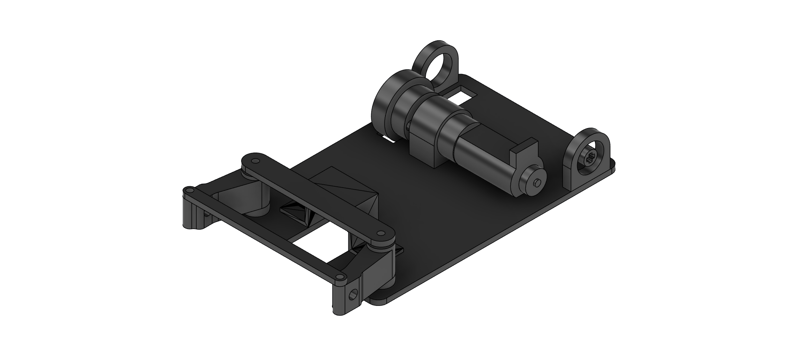
    </td>
  </tr>
</table>

V1 was the first mechanical prototype developed for the current robot. Its purpose was not to create a complete competition-ready vehicle immediately, but to test whether the basic drivetrain, steering and printed-chassis concept could work physically.

The prototype used a 3D-printed base and a **28:28 external gear configuration**, creating a **1:1 external ratio**.

```text
Motor Gear: 28T
      ↓
Differential Gear: 28T

External Ratio = 1:1
```

---

### 3.2.1 Goal of V1

The main engineering question for V1 was:

> **Can the basic motor, drivetrain, chassis and steering concept physically move the vehicle as expected?**

At this stage, simplicity was more important than optimization. The team first needed to establish a working baseline before changing the drivetrain ratio or building a more complex structure.

---

### 3.2.2 Problem Identified

Testing showed that the 1:1 external drivetrain did not provide the amount of low-speed torque and controllability that we wanted.

The robot could move, but acceleration from rest was less controllable, slow movement was difficult and repeated steering corrections were harder to perform consistently. This behavior did not match our precision-focused design philosophy.

The drivetrain result therefore became one of the main reasons for changing the external gear ratio in V2.

---

## 3.3 V2 — Functional Mechanical Prototype

<table align="center">
  <tr>
    <td align="center">
      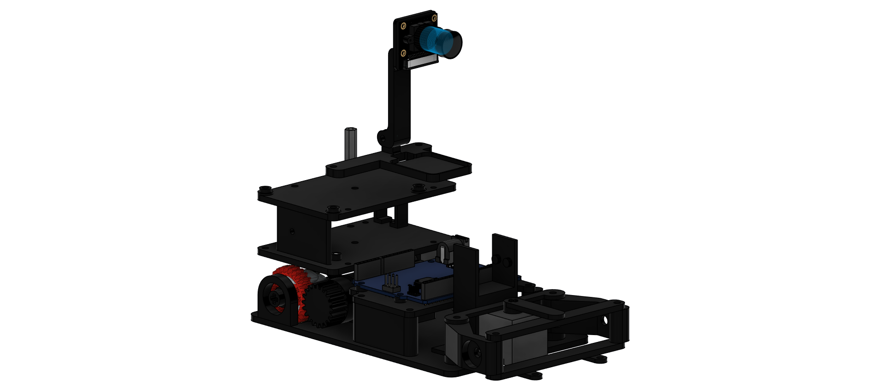
    </td>
  </tr>
</table>

V2 developed the V1 concept into a much more complete mechanical platform.

The motor drive gear was reduced from 28 teeth to **21 teeth**, increasing the external reduction. An Ackermann-style steering architecture was introduced, rear drivetrain bearings were added and the chassis was expanded to support more of the final electronic system.

At this point the robot became mechanically usable, although several areas still required further improvement.

---

### 3.3.1 Drivetrain Change

The drivetrain changed from:

```text
V1

28T → 28T

1:1
```

to:

```text
V2

21T → 28T

28 / 21 ≈ 1.33:1 reduction
```

The smaller driver gear increased the external reduction. The theoretical wheel speed decreased, while the theoretical output torque increased.

In practice, the change also produced better low-speed behavior and made the drivetrain more suitable for repeated autonomous steering corrections.

---

### 3.3.2 Steering Development

V2 introduced the Ackermann-style steering architecture that became the basis of the final steering system.

During a turn, the inner front wheel and outer front wheel follow different path radii. The steering mechanism was therefore designed so that the wheels do not need to use exactly the same steering angle.

This geometry reduces unnecessary tire scrub and better matches the automotive-style motion of the vehicle.

---

### 3.3.3 Bearing Development

V2 also introduced bearings to support the rear drivetrain shaft.

Without bearings, the rotating axle would interact directly with printed structural surfaces. The bearing system separates the rotating shaft from the fixed printed structure and improves alignment, smoothness and rigidity.

This also improves drivetrain consistency over repeated use because the axle is less dependent on sliding directly against the 3D-printed material.

---

## 3.4 V3 — Final Competition Robot

<table align="center">
  <tr>
    <td align="center">
      
    </td>
  </tr>
</table>

Version 3 is the final current mechanical platform.

Unlike the smaller transition from V1 to V2, V3 involved a more complete redesign and physical rebuild. The motor drive gear was reduced again from 21 teeth to **16 teeth**, increasing the final external reduction to 1.75:1.

The rear structure was reinforced with additional pillars, the component layout was revised and new structures were created for the LiDAR / IMU, XL4015 converter and rear handling wing.

---

### 3.4.1 Final Drivetrain Change

The final external drivetrain is:

```text
16T Driver
     ↓
28T Differential

External Reduction
= 28 / 16
= 1.75:1
```

Compared with V2, this configuration provides additional theoretical torque multiplication while further reducing the theoretical maximum drivetrain speed.

After testing the different mechanical versions, the 16:28 configuration provided the most useful balance for our current robot between acceleration, usable speed, low-speed control, torque and repeated steering correction.

---

### 3.4.2 Structural Improvements

The rear section was reinforced using additional vertical supports to improve rigidity around the stacked electronics and sensor structures.

The final robot also integrates the camera support, LiDAR / IMU mount and rear handling structure into the same mechanical platform. This allows the upper sensing system to remain mechanically connected to the main chassis rather than behaving as several independent mounts.

---

## 3.5 Mechanical Evolution Summary

| Version | Driver Gear | External Ratio | Major Mechanical Change | Main Reason |
|---|---:|---:|---|---|
| V0 | Previous-generation configuration | — | Reference vehicle | Learn from previous design |
| V1 | 28T | 1.00:1 | Initial drivetrain / steering prototype | Test basic concept |
| V2 | 21T | 1.33:1 | Ackermann steering + bearings | Increase torque and precision |
| V3 | 16T | 1.75:1 | Final rebuilt platform | Further improve controllability |

---

## 3.6 Iteration Logic

The drivetrain progression demonstrates one of the clearest mechanical trade-offs in the project.

```text
Higher Speed
    ↑
    │
28:28
    │
21:28
    │
16:28
    ↓
Higher Torque / Control
```

The final ratio was not selected only because it produced more theoretical torque. It was selected because the increased reduction produced behavior that better matched the practical requirements of autonomous navigation and parking.

---

# 4. Final Mechanical Architecture

> **[TODO: Add NEW annotated final mechanical layout image]**

The recommended labels for the image are **Main Base, Front Steering Assembly, Steering Servo, Camera Mechanism, Motor, 16T Drive Gear, Differential, Rear Axle, Bearing Mounts, Electrical Base, UNO Base, Raspberry Pi Base, LiDAR / IMU Mount, Rear Wing and Step-down Tray**.

---

## 4.1 Mechanical Layout

The final robot uses a layered mechanical architecture.

```text
               Camera
                  │
            Camera Mount
                  │
              Pi Layer
                  │
         Electronics Layer
                  │
       ┌──────────┴──────────┐
       │                     │
Front Steering          Rear Drivetrain
       │                     │
 Ackermann             Motor + Gear
       │                     │
Front Wheels            Differential
                             │
                        Rear Wheels
```

The drivetrain and steering remain close to the lower structural layer, while the electronics and sensing systems use the vertical space above them.

This arrangement separates the major moving mechanisms from the upper computing and sensor layers while keeping the complete robot compact.

---

# 5. Drivetrain Engineering

## 5.1 Drivetrain Architecture

The final drivetrain transfers power through the following mechanical path:

```text
CHP-20GP-180 Motor
        │
        │ Internal Gearbox
        │ 19:1
        v
Motor Output Shaft
        │
        │ 16-Tooth Custom Gear
        v
28-Tooth Differential Gear
        │
        v
LEGO Differential
     ┌──┴──┐
     │     │
     v     v
 Left    Right
 Wheel   Wheel
```

This architecture combines the motor's internal 19:1 reduction with an additional 16:28 external gear reduction before power reaches the two rear wheels.

---

## 5.2 Motor Selection

### CHP-20GP-180 DC 12 V Geared Motor

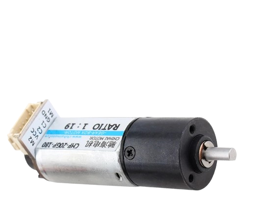
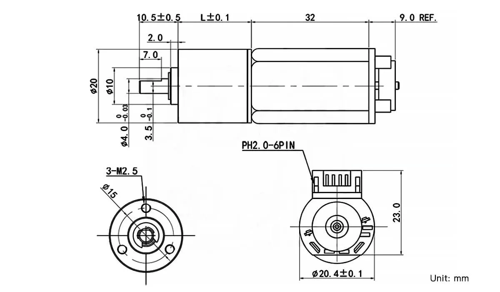

We selected the **CHP-20GP-180 DC geared motor** with a **19:1 internal gearbox** and dual-phase quadrature encoder.

The motor was chosen because its higher reduction provides more torque than faster variants while still maintaining a useful output speed. The integrated encoder also provides motor-rotation feedback, which is valuable for controlled finite movements.

Its physical size was suitable for our compact chassis and the motor remained usable throughout prototype testing. These characteristics made it better suited to the precision-focused behavior required by our autonomous vehicle than simply selecting the highest-speed available option.

---

### 5.2.1 Why We Prioritized the 19:1 Configuration

A faster motor configuration can increase maximum vehicle speed, but that benefit becomes less useful if the robot becomes harder to accelerate smoothly, control through corners, position accurately or park.

The 19:1 configuration therefore reflects the same design philosophy used for the external transmission. We prefer a drivetrain that gives the autonomous software enough mechanical control authority rather than maximizing theoretical speed alone.

---

### 5.2.2 Motor Encoder

The integrated dual-phase encoder measures motor rotation instead of requiring the control system to rely only on the commanded motor power.

This is especially useful when the robot needs a defined amount of drivetrain movement. Battery state, friction and loading can change the relationship between a PWM command and the real physical rotation, while an encoder directly observes rotational motion.

<table align="center">
  <tr>
    <td align="center">
      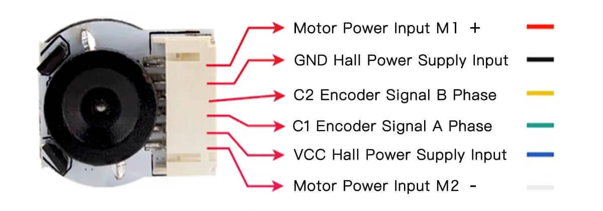
    </td>
  </tr>
</table>

### Encoder Wiring

| Wire | Function |
|---|---|
| Red | Motor power positive |
| Black | Hall-effect sensor GND |
| Yellow | Encoder Signal B |
| Green | Encoder Signal A |
| Blue | Hall-effect sensor 5 V |
| White | Motor power negative |

---

### 5.2.3 Electrical Specifications

| Specification | Value |
|---|---:|
| Voltage | 12 V DC |
| No-Load Current | ≤ 280 mA |
| Rated Current | ≤ 550 mA |
| Stall Current | ≤ 2.7 A |

---

### 5.2.4 Mechanical Specifications

| Specification | Value |
|---|---:|
| Internal Gear Ratio | 19:1 |
| No-Load Speed | ~780 RPM |
| Rated Speed | ~680 RPM |
| Rated Torque | 0.40 kg·cm / 0.039 N·m |
| Stall Torque | ≥ 2.0 kg·cm / 0.196 N·m |
| Gearbox Length | 21.5 mm |

> **[TODO: Before final submission, verify that the RPM values above are the motor output values for the exact purchased 19:1 variant. Previous documentation used an additional ~390 RPM figure that corresponds closely to the final drivetrain output after the 16:28 reduction.]**

---

### 5.2.5 Encoder Specifications

| Specification | Value |
|---|---|
| Type | AB Dual-Phase Hall |
| Resolution | ~211 PPR |
| Supply Voltage | 3.3 V / 5.0 V DC |
| Output | Square Wave |

> **[TODO: Reconcile the ~211 PPR value with the encoder count terminology used in `elec_README.md` and the Arduino implementation so that PPR, quadrature counts and gearbox-output counts are clearly distinguished.]**

---

## 5.3 Custom Motor Drive Gear

### 16-Tooth Motor Gear

<table align="center">
  <tr>
    <td align="center">
      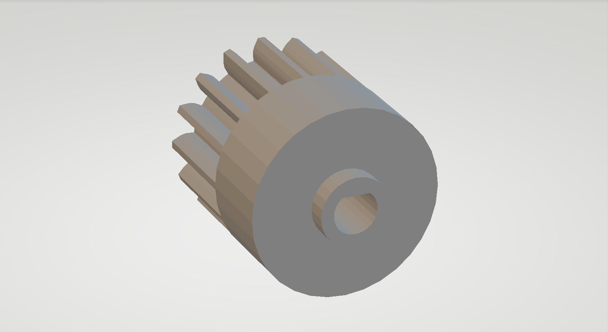
      <p><a href="models/GearAdapter.stl">View 3D model</a></p>
    </td>
  </tr>
</table>

The final drive gear is a custom **16-tooth 3D-printed gear** that connects directly to the CHP-20GP-180 output shaft and meshes with the 28-tooth differential gear.

The center bore is designed to fit the motor shaft tightly to reduce relative slipping. Integrating the shaft interface into the gear itself also eliminates the need for a separate motor-to-gear adapter, keeping the drivetrain more compact.

---

## 5.4 Gearbox Development

### V1 — 28:28

```text
28T Driver
   ↓
28T Driven

Ratio = 1:1
```

The initial configuration used equal-size gears because it was mechanically simple and preserved the motor output speed.

Testing showed that this arrangement did not provide enough usable low-speed torque and control for the behavior we wanted.

---

### V2 — 21:28

```text
21T Driver
   ↓
28T Driven

Reduction = 28 / 21
          ≈ 1.33:1
```

Reducing the driver gear to 21 teeth increased the external reduction. The theoretical output speed decreased, while the theoretical torque increased.

The direct-fit custom gear also maintained a compact connection between the motor and differential.

---

### V3 — 16:28

```text
16T Driver
   ↓
28T Driven

Reduction = 28 / 16
          = 1.75:1
```

The final 16-tooth driver increases torque multiplication further.

The additional reduction sacrifices theoretical maximum speed, but the resulting drivetrain provides more useful low-speed stability, acceleration control and steering authority for our autonomous vehicle.

This became the final configuration.

---

## 5.5 Differential

### LEGO Technic Differential Gear — 28 Teeth

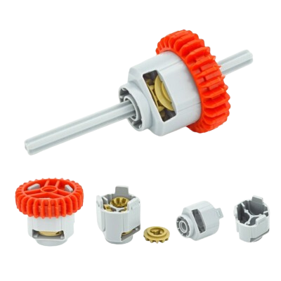
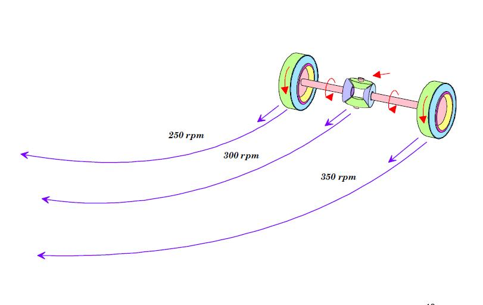

The LEGO Technic differential transfers power to both rear wheels while still allowing the two outputs to rotate at different speeds.

This is important because the inner and outer rear wheels travel different distances during a turn. If both rear wheels were locked to the same rotational speed, one wheel would need to slip or scrub across the field surface.

The differential therefore reduces unnecessary wheel scrub and resistance while improving maneuverability and compatibility with the automotive-style front steering geometry.

---

## 5.6 Final Drivetrain Calculation

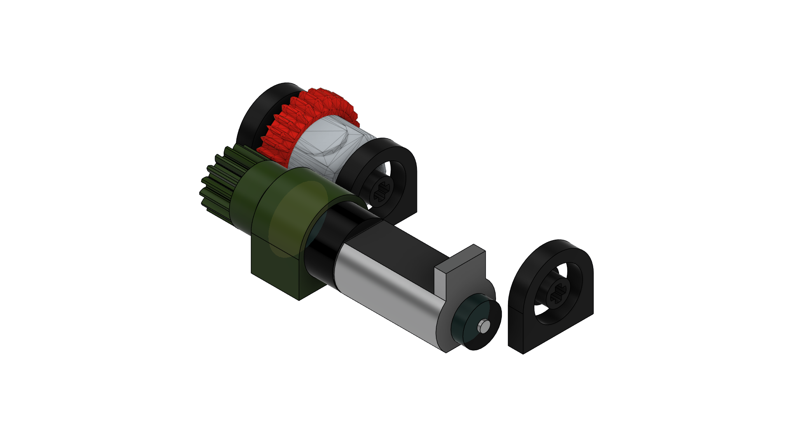

The final external drivetrain uses:

```text
Motor Output Gear = 16 teeth
Differential Gear = 28 teeth
```

---

### Step 1 — External Gear Reduction

```text
External Reduction
= Driven Gear / Driver Gear

= 28 / 16

= 1.75 : 1
```

---

### Step 2 — Rated Output RPM

Using the documented motor rated speed of approximately **680 RPM**:

```text
Output RPM
= Motor Rated RPM / External Reduction

= 680 / 1.75

≈ 389 RPM
```

Using the documented no-load speed of approximately **780 RPM**:

```text
780 / 1.75 ≈ 446 RPM
```

The approximately 389 RPM result explains why an older drivetrain description could contain a value close to 390 RPM even though the motor's documented geared-output rated speed is approximately 680 RPM. These values refer to different points in the transmission.

---

### Step 3 — Output Torque

Using the documented rated motor torque:

```text
Motor Rated Torque = 0.0392 N·m
```

The ideal theoretical torque after the external reduction is:

```text
Output Torque
= Motor Torque × External Reduction

= 0.0392 × 1.75

≈ 0.069 N·m
```

If drivetrain losses are ignored and the differential load is simplified as equally distributed between the two rear outputs:

```text
0.069 / 2

≈ 0.035 N·m per rear output
```

This per-wheel value is a simplified theoretical estimate rather than a directly measured wheel torque.

---

### 5.6.1 Calculated Final Results

| Parameter | Calculated Value |
|---|---:|
| External gear reduction | 1.75:1 |
| Differential input speed — rated | ~389 RPM |
| Differential input speed — no load | ~446 RPM |
| Ideal differential input torque | ~0.069 N·m |
| Simplified ideal torque per rear output | ~0.035 N·m |

> These calculations are ideal theoretical values and do not include mechanical losses from gear friction, bearings, differential friction, tire deformation or drivetrain alignment.

The distinction between calculated and measured values is important because the physical robot will not reproduce the ideal calculation exactly.

---

## 5.7 Wheel Selection

### LEGO Tire 43.2 × 22 ZR  
### Wheel 30.4 mm D × 20 mm Reinforced Rim

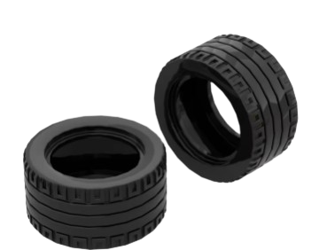
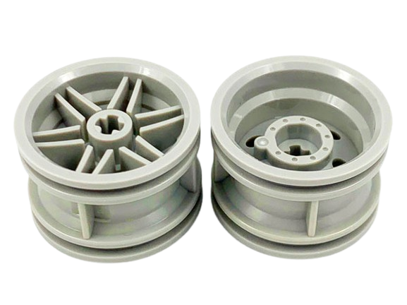

The selected wheel size provides a practical balance between ground speed, acceleration, axle torque demand, ground clearance and vehicle controllability.

A smaller wheel travels less distance for each axle revolution and therefore reduces linear vehicle speed. A larger wheel travels farther per revolution but also requires more axle torque to create the same force at the ground.

The selected LEGO wheel and tire combination works with the final drivetrain reduction while maintaining predictable handling and sufficient physical clearance for the chassis.

---

# 6. Steering System

## 6.1 Steering Architecture

The final robot uses a servo-driven **Ackermann-style front steering system**.

<table align="center">
  <tr>
    <td align="center">
      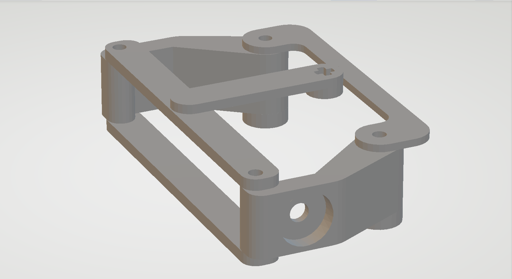
      <p><a href="models/SteeringSystem.stl">View 3D model</a></p>
    </td>
  </tr>
</table>

---

## 6.2 Why Ackermann-Style Steering?

During a turn, the inner front wheel travels around a smaller radius than the outer front wheel. The front wheels therefore should not ideally use exactly the same steering angle.

Conceptually:

```text
                Turn Centre
                     ●
                    /|
                   / |
          Inner   /  |  Outer
          Wheel  /   |  Wheel
```

The inward steering-arm geometry approximates this Ackermann relationship.

The purpose of the design is to reduce unnecessary tire scrub and turning resistance while creating more predictable automotive-style cornering. This geometry also works naturally with the rear differential, which allows the rear wheels to rotate at different speeds through the same turn.

---

## 6.3 Steering Components

<table align="center">
  <tr>
    <td align="center">
      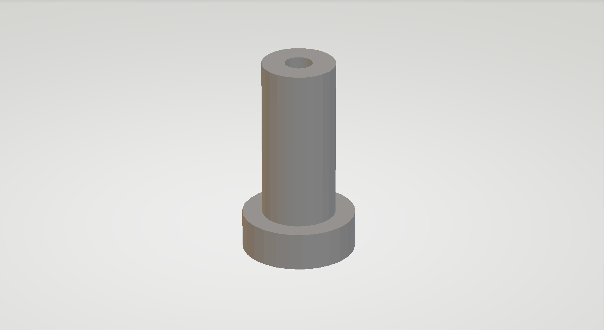
      <p><a href="models/SteeringAxle.stl">Steering Axle</a></p>
    </td>
    <td align="center">
      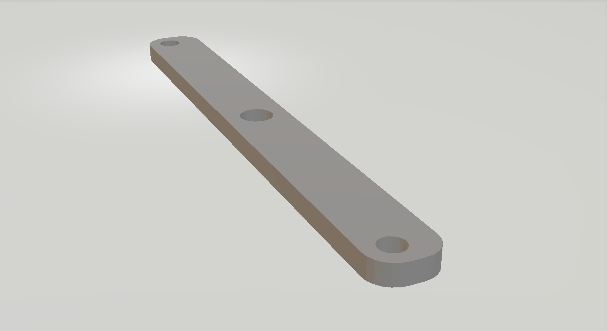
      <p><a href="models/Top_SteeringMount.stl">Top Steering Mount</a></p>
    </td>
    <td align="center">
      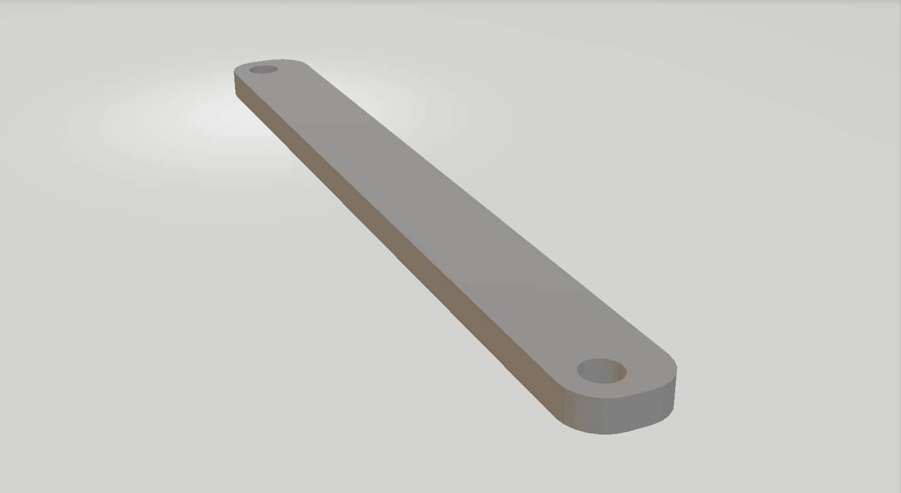
      <p><a href="models/Bottom_SteeringMount.stl">Bottom Steering Mount</a></p>
    </td>
  </tr>
</table>

<table align="center">
  <tr>
    <td align="center">
      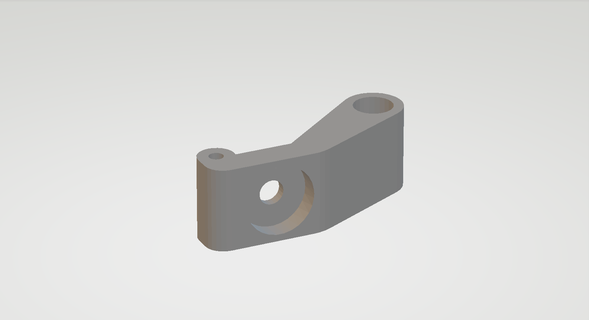
      <p><a href="models/L_SteeringArm.stl">Left Steering Arm</a></p>
    </td>
    <td align="center">
      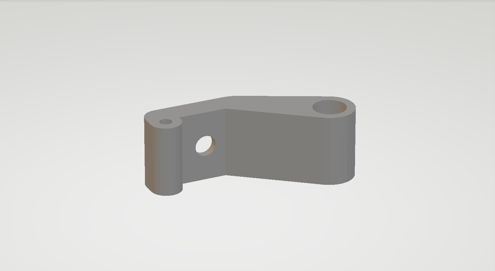
      <p><a href="models/R_SteeringArm.stl">Right Steering Arm</a></p>
    </td>
    <td align="center">
      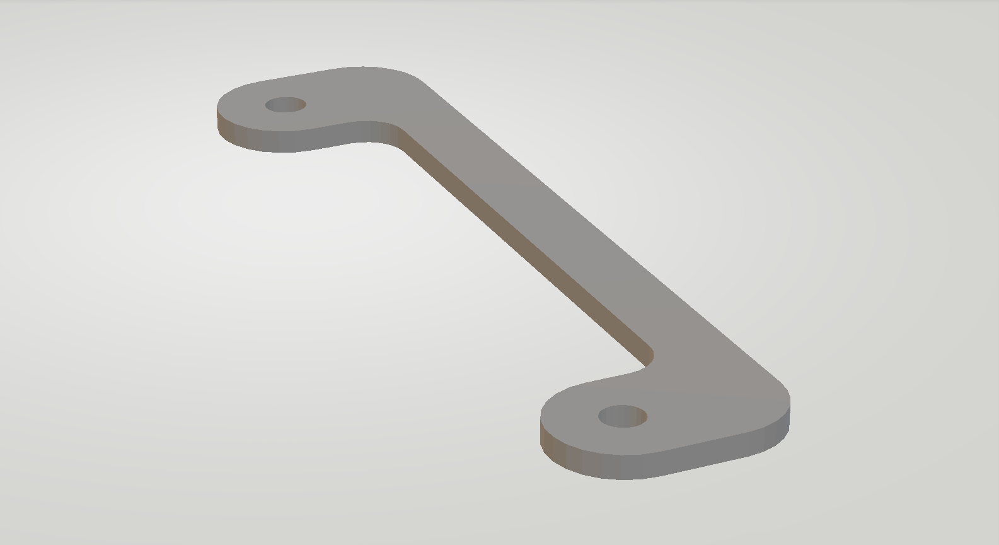
      <p><a href="models/Top_SteeringCap.stl">Top Steering Cap</a></p>
    </td>
    <td align="center">
      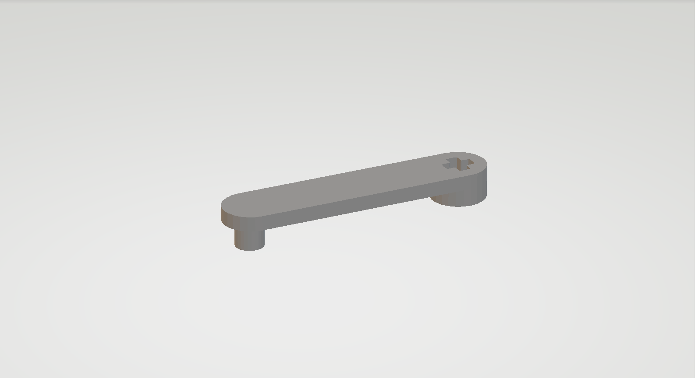
      <p><a href="models/SteeringLinkageArm.stl">Steering Linkage Arm</a></p>
    </td>
  </tr>
</table>

### Steering Axle

The steering axle acts as the primary pivot for the steering arms. It maintains wheel alignment while still allowing the arms to rotate with minimal unwanted lateral movement.

### Steering Linkage Arm

The linkage connects the steering servo to the two front steering arms. It converts servo rotation into the push-pull motion that changes the angle of both front wheels.

### Top Steering Mount / Cap

The upper structure stabilizes the steering pivots and works together with the lower structure to maintain steering rigidity.

### Bottom Steering Mount

The lower mount supports and aligns the steering pivots.

An earlier version of this part also included a location for the light sensor used in the original sensing concept. Although the light sensor was removed from the final robot, the feature is part of the mechanical development history because it shows that the steering structure changed together with the sensing architecture.

### Left and Right Steering Arms

The steering arms connect the linkage to the front wheels. Their inward geometry produces the approximate Ackermann relationship between the inner and outer wheel angles during cornering.

---

## 6.4 Steering Geometry Measurements

The final mechanical documentation should include measured steering geometry from the completed V3 robot rather than relying only on CAD assumptions.

| Measurement | Final Value |
|---|---|
| Wheelbase | **[TODO]** |
| Front track width | **[TODO]** |
| Maximum inner wheel steering angle | **[TODO]** |
| Maximum outer wheel steering angle | **[TODO]** |
| Minimum turning radius | **[TODO]** |

These measurements are especially useful because the software steering model depends on the real physical geometry of the vehicle.

---

## 6.5 Steering Servo

### GEEKSERVO 2 kg 360° Servo

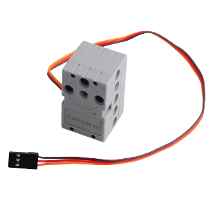

The GEEKSERVO was selected because it provides sufficient torque and response for the steering mechanism while remaining mechanically compatible with LEGO-style mounting.

This compatibility simplifies its integration with the hybrid custom-printed and LEGO mechanical structure. The servo has also been used through the prototype process without significant mechanical failure.

The gear mechanism can slip under excessive blocking load rather than remaining completely rigid, which may reduce mechanical damage during severe overload.

### Servo Wiring

| Wire | Function |
|---|---|
| Red | Positive |
| Brown | Ground |
| Yellow | Signal |

### Electrical Specifications

| Specification | Value |
|---|---:|
| Working Voltage | 3.3–6 V |
| Rated Voltage | 4.8 V |
| Rated Current | 200 mA |
| Stall Current | 700 mA |
| Sliding Current | 450 mA |

---

## 6.6 Servo Bracket

<table align="center">
  <tr>
    <td align="center">
      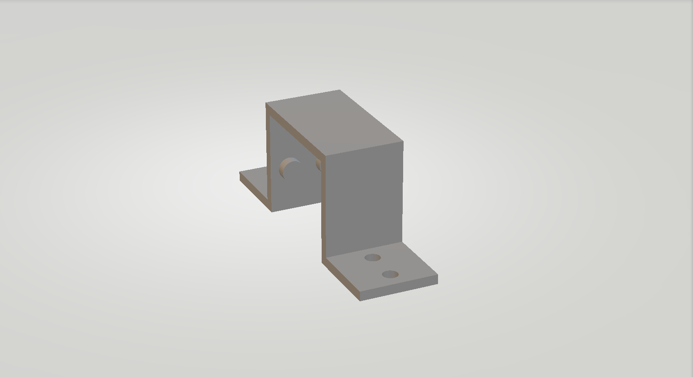
      <p><a href="models/ServoBracket.stl">View 3D model</a></p>
    </td>
  </tr>
</table>

The servo bracket holds the steering actuator at the required height and alignment relative to the steering linkage.

Its cylindrical mounting features allow the LEGO-compatible servo to integrate directly with the surrounding structure. The part was designed to remain compact and lightweight while still being simple to print and rigid enough to prevent unwanted actuator movement.

---

# 7. Structural Design and Final 3D Components

The final chassis is divided into modular structural layers instead of being printed as one large part.

This makes individual components easier to manufacture and replace. It also allows one area of the robot to be redesigned without requiring the complete chassis to be reprinted.

The layered structure is especially useful for organizing the electronics vertically while keeping the drivetrain and steering mechanisms near the lower part of the vehicle.

---

## 7.1 Main Base

<table align="center">
  <tr>
    <td align="center">
      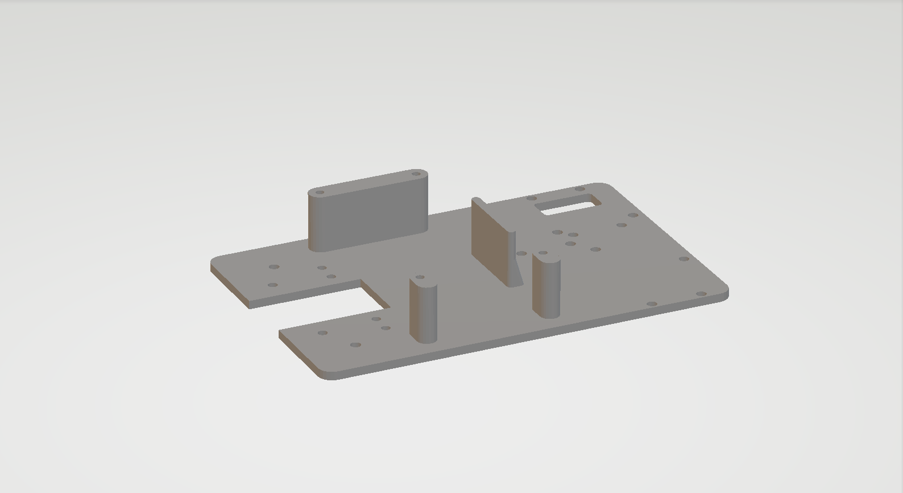
      <p><a href="models/MainBase.stl">View 3D model</a></p>
    </td>
  </tr>
</table>

The Main Base is the primary structural layer of the robot. It supports the battery, Arduino UNO R4, steering servo and the main drivetrain components.

Placing several of the heavier mechanical and electrical components near the bottom of the robot helps keep the center of mass lower. The base also provides the mounting points that support the upper structural layers.

---

## 7.2 Supporting Base 1 — Electrical Base

<table align="center">
  <tr>
    <td align="center">
      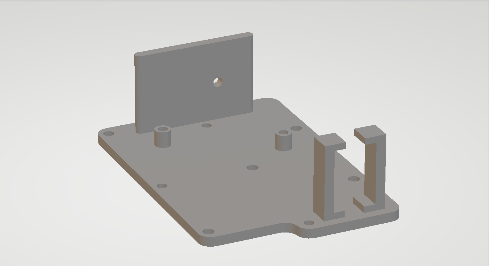
      <p><a href="models/ElecPlate.stl">View 3D model</a></p>
    </td>
  </tr>
</table>

The Electrical Base supports the LM2596 converter, PCT-21 ground connector, D1-2 positive connector, main power switch and competition start switch.

The plate also contributes to the structural support of the Raspberry Pi layer above it, so it functions as both an electronics mount and part of the stacked chassis.

---

## 7.3 Supporting Base 2 — Arduino Base

<table align="center">
  <tr>
    <td align="center">
      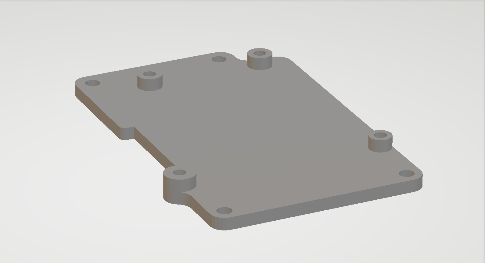
      <p><a href="models/UnoPlate.stl">View 3D model</a></p>
    </td>
  </tr>
</table>

The Arduino Base supports the Arduino UNO R4 Minima and its motor-control hardware. The XL4015 assembly is also integrated around this section of the robot.

This arrangement keeps the low-level control hardware close to the drivetrain and steering system while leaving the upper layers available for high-level computing and sensors.

---

## 7.4 Supporting Base 3 — Raspberry Pi Base

<table align="center">
  <tr>
    <td align="center">
      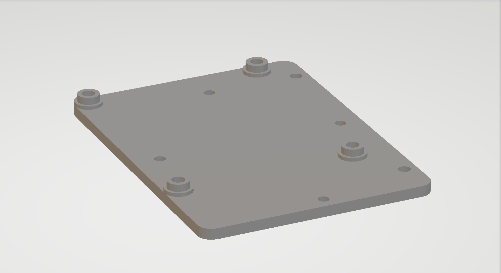
      <p><a href="models/PiPlate.stl">View 3D model</a></p>
    </td>
  </tr>
</table>

This layer supports the Raspberry Pi 5, Raspberry Pi I/O Expansion HAT, camera structure and rear structural supports.

Using the upper vertical space for the high-level computer keeps the Raspberry Pi away from the main drivetrain while still allowing it to remain connected to the camera, LiDAR, IMU and Arduino.

---

## 7.5 Motor Bracket

<table align="center">
  <tr>
    <td align="center">
      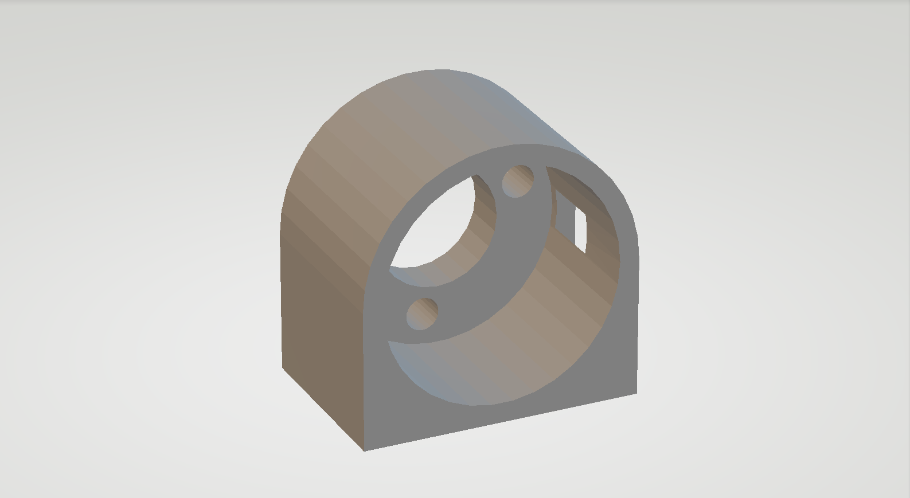
      <p><a href="models/MotorBracket.stl">View 3D model</a></p>
    </td>
  </tr>
</table>

The motor bracket is a custom 3D-printed structural component that holds the CHP-20GP-180 rigidly relative to the differential.

The mount includes threaded features that allow screws to be installed without requiring separate nuts in some locations. This keeps the assembly compact while maintaining access during maintenance.

Motor alignment is mechanically important because misalignment between the 16T motor gear and the 28T differential gear can increase friction, create poor tooth engagement or increase drivetrain wear.

---

## 7.6 Rear Bearing Mount System

<table align="center">
  <tr>
    <td align="center">
      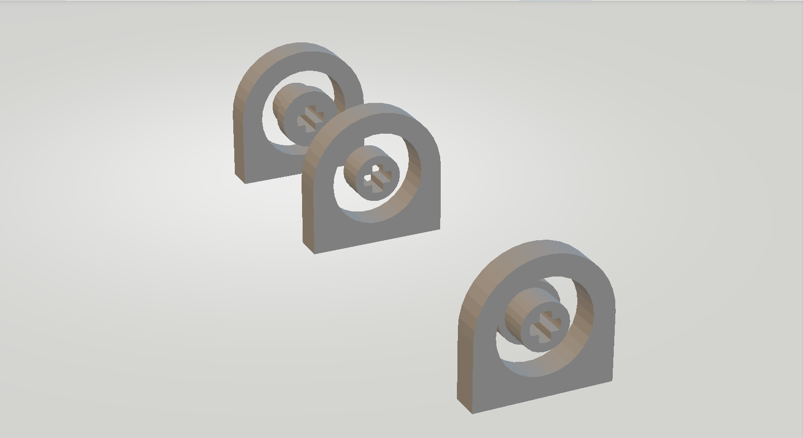
      <p><a href="models/BearingSystem.stl">View 3D model</a></p>
    </td>
  </tr>
</table>

<table align="center">
  <tr>
    <td align="center">
      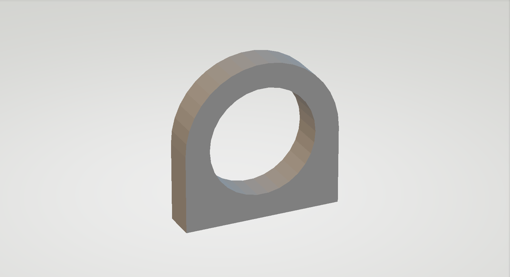
      <p><a href="models/BearingMount.stl">Bearing Mount</a></p>
    </td>
    <td align="center">
      
      <p><a href="models/L%26R_AxleSleeve.stl">Left / Right Axle Sleeve</a></p>
    </td>
    <td align="center">
      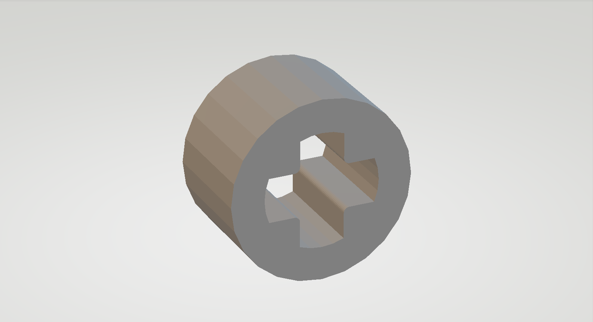
      <p><a href="models/Mid_AxleSleeve.stl">Middle Axle Sleeve</a></p>
    </td>
  </tr>
</table>

The rear drivetrain uses ball bearings to support the differential output shaft. The inner bearing race interfaces with the shaft through custom sleeves, while the outer race remains fixed in the printed bearing mount.

This arrangement prevents the rotating axle from sliding directly against the printed structure. It improves rotational efficiency, axle alignment, rigidity, durability and drivetrain consistency.

---

## 7.7 Rear Wing / Handling Structure

<table align="center">
  <tr>
    <td align="center">
      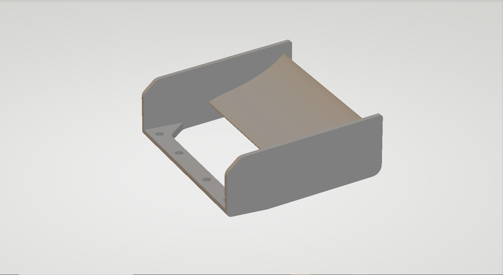
      <p><a href="models/RearWing.stl">View 3D model</a></p>
    </td>
  </tr>
</table>

The rear wing is based on an **S1223 airfoil profile**, but aerodynamic performance is not its primary function on this robot.

At the relatively low operating speed of the vehicle, and with the nearby camera structure disturbing the airflow, meaningful aerodynamic downforce is expected to be very small.

The part is therefore used mainly as a structural rear element, additional support for the camera assembly and a practical handling point when carrying the robot.

This interpretation avoids claiming an aerodynamic benefit that has not been demonstrated at the robot's operating speed.

---

## 7.8 Step-Down Tray

<table align="center">
  <tr>
    <td align="center">
      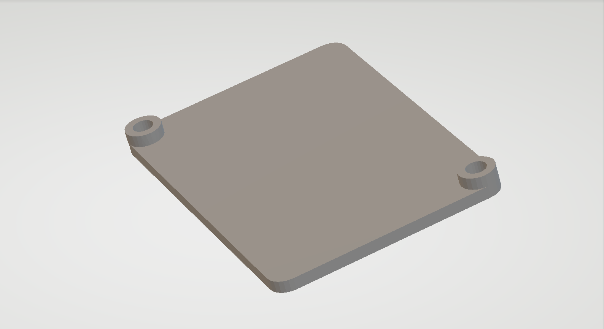
      <p><a href="models/StepdownTray.stl">View 3D model</a></p>
    </td>
  </tr>
</table>

The Step-Down Tray holds the XL4015 converter above the Arduino / motor-shield section.

The tray allows the converter to be fixed mechanically instead of depending only on the connected wiring to hold it in position. This reduces unwanted movement and improves the organization of the final electrical layout.

---

# 8. Mechanical Sensor and Electronics Integration

Mechanical design affects sensor performance directly.

A sensor may be electrically correct but still produce poor information if it is mounted at the wrong orientation, if its field of view is obstructed or if its supporting structure moves excessively.

For this reason, the chassis is designed to hold the sensors rigidly, maintain the required orientation and keep their sensing areas as clear as possible.

---

## 8.1 Camera Positioning Mechanism

<table align="center">
  <tr>
    <td align="center">
      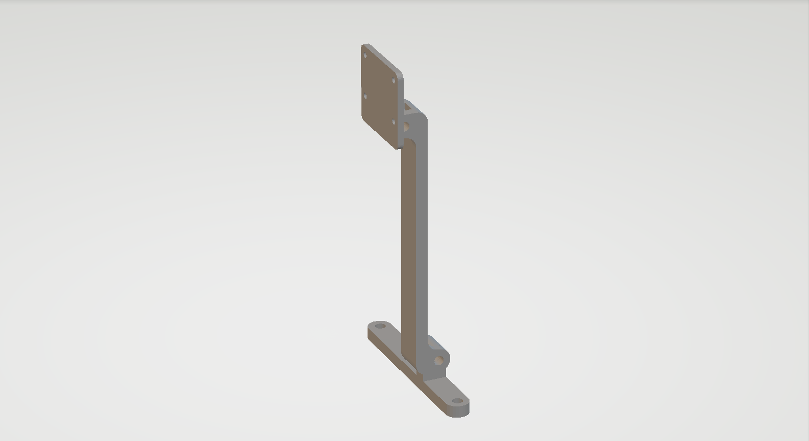
      <p><a href="models/CamMount.stl">View 3D model</a></p>
    </td>
  </tr>
</table>

The camera positioning mechanism allows the camera height and angle to be adjusted without redesigning the complete chassis.

A completely fixed mount would require CAD modification and reprinting whenever the team wanted to test a different camera position:

```text
Change Camera Position
        ↓
Modify CAD
        ↓
Reprint Part
        ↓
Reassemble Robot
```

The adjustable system instead allows:

```text
Change Camera Position
        ↓
Adjust Existing Mechanism
        ↓
Continue Testing
```

This reduces mechanical iteration time and allows the camera view to be tuned more quickly during testing.

---

### 8.1.1 Camera Components

<table align="center">
  <tr>
    <td align="center">
      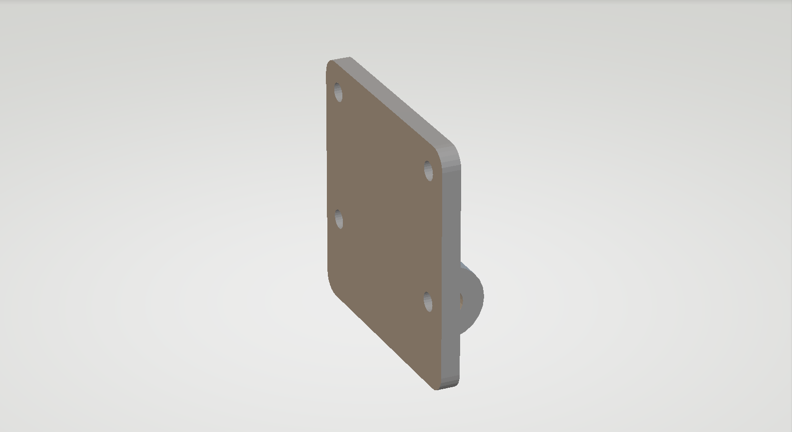
      <p><a href="models/CamPlate.stl">Camera Plate</a></p>
    </td>
    <td align="center">
      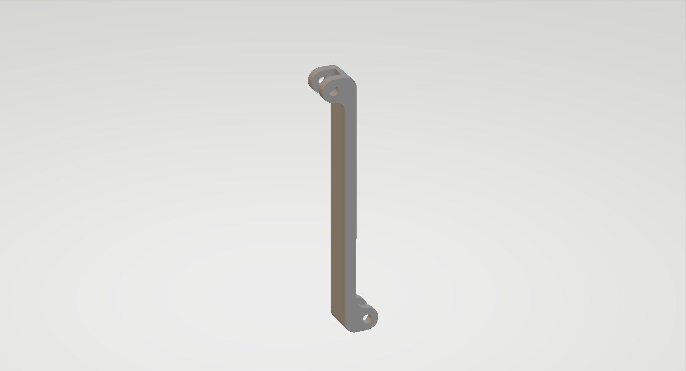
      <p><a href="models/CamArm.stl">Camera Arm</a></p>
    </td>
    <td align="center">
      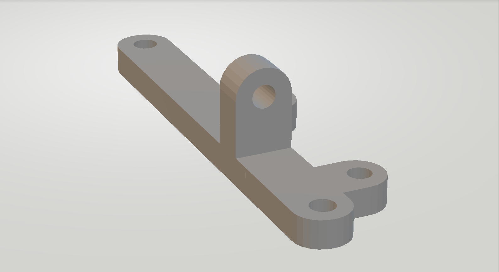
      <p><a href="models/CamArmConnector.stl">Camera Arm Connector</a></p>
    </td>
  </tr>
</table>

### Camera Plate

The camera plate holds the camera rigidly so that its orientation does not change unnecessarily during autonomous operation.

### Camera Arm

The camera arm positions the camera at the required height and angle while maintaining a clear view toward the field.

### Camera Arm Connector

The connector links the camera support to the Raspberry Pi / rear structural area. This spreads the load into the surrounding chassis and improves rigidity during acceleration, braking and steering.

---

## 8.2 LiDAR and IMU Mount

<table align="center">
  <tr>
    <td align="center">
      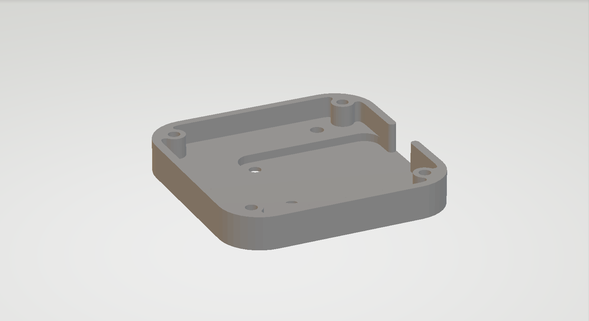
      <p><a href="models/LiDARMount.stl">View 3D model</a></p>
    </td>
  </tr>
</table>

The LiDAR mount holds the RPLiDAR securely while maintaining a clear scanning area around the sensor.

Its recessed centre creates space for the BNO055 underneath the LiDAR. This makes more efficient use of the vertical space, reduces congestion around the Raspberry Pi and keeps the LiDAR mechanically stable.

The IMU position also moves the device away from some of the denser electronics and wiring near the Pi. Because the BNO055 contains a magnetometer, physical separation from high-current wiring and electronics may be beneficial, although the improvement has not been quantified experimentally.

---

# 9. Manufacturing and Material Selection

Most custom components are produced by FDM 3D printing.

This manufacturing method allows the team to modify one part, print a new version and test it without waiting for a commercial chassis component. It is particularly useful for the iterative development of the drivetrain mounts, steering system and sensor structures.

---

## 9.1 3D Printer

### Bambu Lab H2D

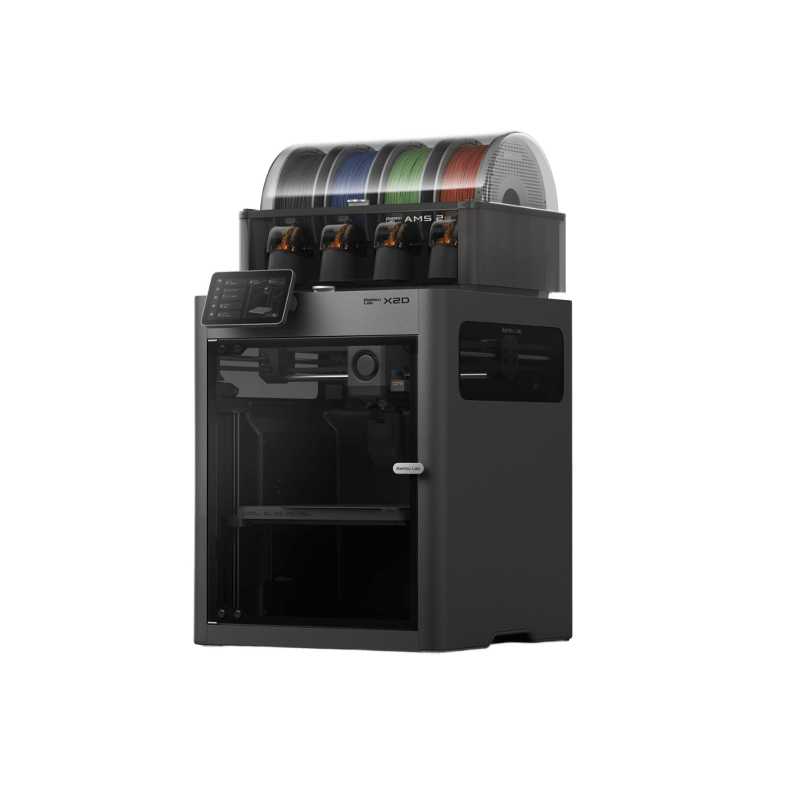

The **Bambu Lab H2D** was used to manufacture the custom robot components.

Its printing speed and dimensional capability were useful during rapid prototype development, while the enclosed heated system and high-temperature hotend allowed the team to use engineering materials such as ABS and ABS-GF.

The large build volume was also sufficient for the major chassis plates and structural components.

---

### 9.1.1 General Specifications

| Specification | Value |
|---|---|
| Build Volume | 325 × 320 × 325 mm³ — Single Nozzle |
| Dual-Nozzle Build Volume | 300 × 320 × 325 mm³ |
| Hotend | All-Metal |
| Included Nozzle | 0.4 mm Hardened Steel |
| Maximum Nozzle Temperature | 350°C |
| Filament Diameter | 1.75 mm |
| Maximum Toolhead Speed | 1000 mm/s |
| Maximum Acceleration | 20,000 mm/s² |
| Maximum Chamber Temperature | 65°C |
| Maximum Heatbed Temperature | 120°C |
| Supported Nozzle Sizes | 0.2 / 0.4 / 0.6 / 0.8 mm |

---

### 9.1.2 Physical Dimensions

| Specification | Value |
|---|---|
| Printer Dimensions | 492 × 514 × 626 mm³ |
| Net Weight | 31 kg |

---

### 9.1.3 Build Plate

| Specification | Value |
|---|---|
| Build Plate | Flexible Steel Plate |
| Included Plate | Textured PEI |
| Supported Plates | Textured PEI / Smooth PEI |
| Maximum Heatbed Temperature | 120°C |
| Heated Chamber | Up to 65°C |

---

## 9.2 Filament Selection

### Bambu Lab ABS and ABS-GF

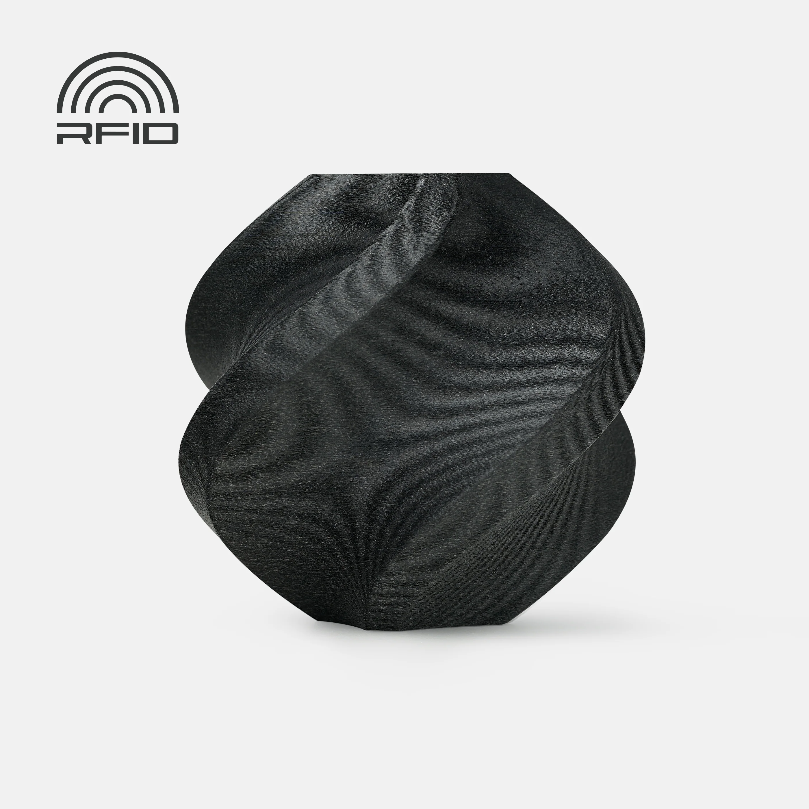


The custom robot uses both **ABS** and **ABS-GF**, which is glass-fiber-reinforced ABS.

---

### ABS

ABS provides a useful balance of impact toughness, strength and a relatively smooth printed surface. It also retains more flexibility than the glass-fiber-reinforced material.

For this reason, ABS is suitable for general structural components and locations where extreme stiffness is not the primary requirement.

---

### ABS-GF

ABS-GF contains glass-fiber reinforcement, which increases the material's stiffness and dimensional stability.

It is therefore useful for components where deformation or flex is more critical, although the increase in stiffness comes with lower impact toughness compared with standard ABS.

---

### 9.2.1 Material Trade-off

| Property | ABS | ABS-GF |
|---|---|---|
| Impact toughness | Higher | Lower |
| Stiffness | Lower | Higher |
| Dimensional stability | Good | Higher |
| Surface texture | Smoother | Rougher |
| Best use | General / impact-tolerant parts | Rigid structural parts |

---

### 9.2.2 Material Specifications

| Specification | Bambu Lab ABS | Bambu Lab ABS-GF |
|---|---:|---:|
| Material | ABS | Glass-Fiber Reinforced ABS |
| XY Impact Strength | 39.3 kJ/m² | 14.5 kJ/m² |
| XY Bending Strength | 62 MPa | 68 MPa |
| XY Bending Modulus | 1880 MPa | 2860 MPa |
| Z Impact Strength | 7.4 kJ/m² | 5.3 kJ/m² |
| HDT @ 0.45 MPa | 87°C | 99°C |
| Filament Diameter | 1.75 mm | 1.75 mm |

The material data shows the main trade-off clearly:

> **ABS provides greater impact toughness, while ABS-GF provides greater stiffness and heat resistance.**

The final robot therefore does not use one material for every printed component. Material choice depends on the mechanical function and required behavior of the part.

> **[TODO: Add manufacturer datasheet links for the material-property values above.]**

---

# 10. Mechanical Testing and Iteration

Mechanical testing is used as part of the design process rather than only as a final check that the robot moves.

The clearest example is the drivetrain, where the external ratio changed twice because the earlier configurations did not provide the level of low-speed control we wanted.

---

## 10.1 Drivetrain Testing

| Version | Configuration | Observation | Decision |
|---|---|---|---|
| V1 | 28:28 | Insufficient low-speed torque / control | Increase reduction |
| V2 | 21:28 | Improved torque and controllability | Test further reduction |
| V3 | 16:28 | Best balance found for current robot | Selected as final |

This progression provides direct evidence that testing affected the final mechanical architecture rather than merely confirming a design that had already been selected.

---

## 10.2 Testing Logic

```text
V1 — 28:28
      │
      │ Low-speed control insufficient
      v
V2 — 21:28
      │
      │ Improved, but further torque desired
      v
V3 — 16:28
      │
      v
Final Configuration
```

The progression demonstrates the trade-off between theoretical maximum speed and usable torque/control.

---

## 10.3 Steering Testing

The steering mechanism was evaluated together with the software rather than only from CAD geometry.

Dedicated steering-calibration tools later showed that the real robot did not turn exactly according to the original assumed steering model. The measured vehicle turned approximately **21% more than the original assumed full-lock value**.

This is important because the physical steering geometry directly affects the Pure Pursuit model used by the software. Measuring the assembled robot therefore provides more useful information than assuming the printed mechanism behaves exactly like the ideal CAD design.

---

## 10.4 Additional Mechanical Measurements

The following values should be measured directly from the completed Version 3 robot.

| Measurement | Final Value |
|---|---|
| Robot length | **[TODO]** |
| Robot width | **[TODO]** |
| Robot height | **[TODO]** |
| Robot mass | **[TODO]** |
| Wheelbase | **[TODO]** |
| Front track width | **[TODO]** |
| Rear track width | **[TODO]** |
| Minimum turning radius | **[TODO]** |
| Maximum steering angle | **[TODO]** |

---

# 11. Mechanical Trade-offs and Engineering Decisions

The final mechanical platform contains several deliberate trade-offs.

| Decision | Benefit | Cost / Trade-off | Final Reason |
|---|---|---|---|
| 19:1 motor gearbox | Higher torque | Lower motor speed | Better low-speed behavior |
| 16:28 external reduction | Additional torque multiplication | Reduced wheel speed | Precision prioritized |
| Differential | Reduced wheel scrub during turns | More mechanical parts | Better cornering behavior |
| Ackermann-style steering | More appropriate inner/outer wheel geometry | Increased design complexity | Better automotive motion |
| Bearings | Lower shaft friction and better alignment | Additional components | Improved reliability |
| Adjustable camera mount | Rapid physical tuning | More parts / joints | Faster iteration |
| Layered chassis | Efficient use of volume | Taller structure | Better electronics organization |
| ABS-GF | Higher stiffness | Lower impact toughness | Used where rigidity is critical |
| ABS | Higher toughness | Lower stiffness | Used where impact tolerance is useful |
| Rear wing as handle | Strong handling point | Additional mass | Practical handling / support |
| Custom printed drivetrain parts | Rapid modification | Potential wear / tolerances | Enables fast prototype iteration |

---

## 11.1 Most Important Mechanical Decision

The most important mechanical trade-off in the project is:

> **Maximum speed vs. torque and controllability.**

Our prototype development showed that maximizing drivetrain speed did not create the most useful autonomous vehicle.

The final system therefore combines a **19:1 internal motor gearbox** with a **1.75:1 external reduction**. This sacrifices theoretical maximum wheel speed in exchange for greater torque multiplication and more controllable behavior at lower speed.

That trade-off directly supports the steering corrections, close obstacle passes and parking movements required by the autonomous software.

---

# 12. Mechanical Risks and Failure Modes

Mechanical reliability also requires the team to consider what can go wrong rather than only documenting the intended geometry.

| Mechanical Risk / Failure Mode | Possible Effect | Design Response |
|---|---|---|
| Insufficient drivetrain torque | Poor acceleration / inconsistent low-speed movement | Increase external reduction |
| Excessive drivetrain speed | Harder steering and parking control | Select higher reduction |
| Gear misalignment | Friction, wear, poor power transfer | Rigid motor bracket |
| Rear axle bending / friction | Inconsistent drivetrain behavior | Bearing-supported axle |
| Steering play | Inconsistent wheel angle | Rigid steering mounts and pivots |
| Printed-part deformation | Misalignment | Use ABS-GF where additional stiffness is needed |
| Camera vibration | Unstable image | Rigid camera plate and support |
| LiDAR mounting error | Incorrect scan geometry | Dedicated rigid LiDAR mount |
| Electronics structure flex | Sensor / wiring movement | Reinforced rear structure |
| Mechanical obstruction | Limited sensor view | Elevated / dedicated sensor mounts |

The important connection is that several of these mechanical failures would also appear as software or sensing problems. For example, a moving camera mount can look like a vision problem, and an incorrectly aligned LiDAR mount can look like a localization problem.

Mechanical stability is therefore part of the reliability of the complete autonomous system.

---

# 13. CAD Files and Reproducibility

The final mechanical platform is designed so that another builder can reproduce the structure using the CAD / STL files provided in the repository.

The detailed assembly sequence is documented separately in:

[`../BUILD.md`](../BUILD.md)

This README explains the design reasoning, while `BUILD.md` explains the order in which the mechanical structure should be manufactured and assembled.

---

## 13.1 Final Mechanical Files

| Component | Model | STL File |
|---|---|---|
| Main Base |  | [`MainBase.stl`](models/MainBase.stl) |
| Electrical Base |  | [`ElecPlate.stl`](models/ElecPlate.stl) |
| Arduino Base |  | [`UnoPlate.stl`](models/UnoPlate.stl) |
| Raspberry Pi Base |  | [`PiPlate.stl`](models/PiPlate.stl) |
| 16T Driver Gear |  | [`GearAdapter.stl`](models/GearAdapter.stl) |
| Motor Bracket |  | [`MotorBracket.stl`](models/MotorBracket.stl) |
| Bearing System |  | [`BearingSystem.stl`](models/BearingSystem.stl) |
| Bearing Mount |  | [`BearingMount.stl`](models/BearingMount.stl) |
| Left / Right Axle Sleeve |  | [`L&R_AxleSleeve.stl`](models/L%26R_AxleSleeve.stl) |
| Middle Axle Sleeve |  | [`Mid_AxleSleeve.stl`](models/Mid_AxleSleeve.stl) |
| Steering System |  | [`SteeringSystem.stl`](models/SteeringSystem.stl) |
| Steering Axle |  | [`SteeringAxle.stl`](models/SteeringAxle.stl) |
| Top Steering Mount |  | [`Top_SteeringMount.stl`](models/Top_SteeringMount.stl) |
| Bottom Steering Mount |  | [`Bottom_SteeringMount.stl`](models/Bottom_SteeringMount.stl) |
| Left Steering Arm |  | [`L_SteeringArm.stl`](models/L_SteeringArm.stl) |
| Right Steering Arm |  | [`R_SteeringArm.stl`](models/R_SteeringArm.stl) |
| Top Steering Cap |  | [`Top_SteeringCap.stl`](models/Top_SteeringCap.stl) |
| Steering Linkage |  | [`SteeringLinkageArm.stl`](models/SteeringLinkageArm.stl) |
| Servo Bracket |  | [`ServoBracket.stl`](models/ServoBracket.stl) |
| Camera Mount |  | [`CamMount.stl`](models/CamMount.stl) |
| Camera Plate |  | [`CamPlate.stl`](models/CamPlate.stl) |
| Camera Arm |  | [`CamArm.stl`](models/CamArm.stl) |
| Camera Connector |  | [`CamArmConnector.stl`](models/CamArmConnector.stl) |
| LiDAR / IMU Mount |  | [`LiDARMount.stl`](models/LiDARMount.stl) |
| Rear Wing |  | [`RearWing.stl`](models/RearWing.stl) |
| Step-Down Tray |  | [`StepdownTray.stl`](models/StepdownTray.stl) |

---

# 14. Final Mechanical Configuration

The final Version 3 drivetrain uses the **CHP-20GP-180 DC geared motor** with its **19:1 internal reduction**, integrated dual-phase encoder, custom **16-tooth motor gear**, LEGO Technic **28-tooth differential**, **1.75:1 external reduction**, bearing-supported rear axle and LEGO wheel system.

The steering system uses the **GEEKSERVO** together with the custom servo bracket, steering linkage, left and right steering arms, steering axle and upper/lower mounting structure. The geometry approximates Ackermann steering so that the inner and outer wheels can follow different turning radii.

The main chassis is formed by the **Main Base**, **Electrical Base**, **Arduino Base** and **Raspberry Pi Base**, together with the reinforced rear structure and rear handling wing.

Sensor mounting is integrated mechanically through the adjustable camera mechanism and dedicated LiDAR / IMU mount. These structures are intended to maintain sensor alignment while allowing the camera position to be tuned during testing.

The custom components are manufactured primarily using the **Bambu Lab H2D** with **ABS** and **ABS-GF**. The modular printed architecture allows individual mechanical parts to be changed without rebuilding the entire robot.

---

# Final Mechanical Summary

The mechanical development of YBR-SUNFLOWER progressed from a previous-generation reference vehicle through three current-generation mechanical stages.

```text
Previous-Generation Reference
            ↓
Basic Mechanical Prototype
            ↓
Torque + Steering Improvement
            ↓
Complete Mechanical Rebuild
            ↓
Final Competition Platform
```

The final robot reflects several deliberate engineering decisions.

Torque and low-speed controllability were prioritized over maximum theoretical speed, which led to the progression from 28:28 to 21:28 and finally 16:28 external gearing. The rear differential and Ackermann-style steering were selected to better support automotive-style cornering, while bearings improved drivetrain alignment and reduced direct axle friction against printed components.

The chassis uses modular printed layers so that mechanical parts can be redesigned and replaced independently. Material selection is based on the different stiffness and toughness characteristics of ABS and ABS-GF, while the adjustable camera structure and dedicated LiDAR / IMU mount allow sensor requirements to influence the mechanical design directly.

The final mechanical platform is therefore not simply a set of selected parts. It is the result of repeated engineering iteration:

> **Design → Build → Test → Identify → Modify → Validate**

Each major mechanical change was made to move the robot toward greater controllability, structural reliability and repeatable autonomous performance.
